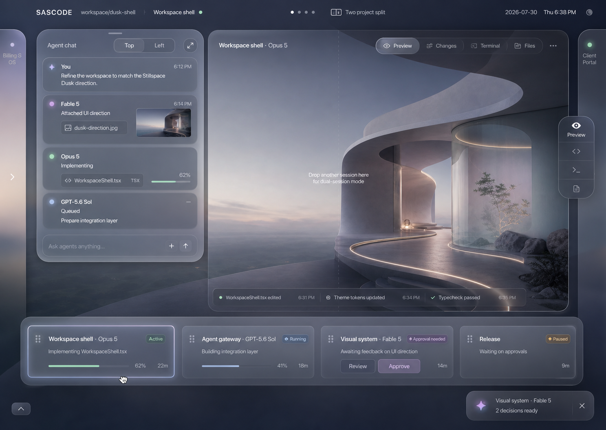
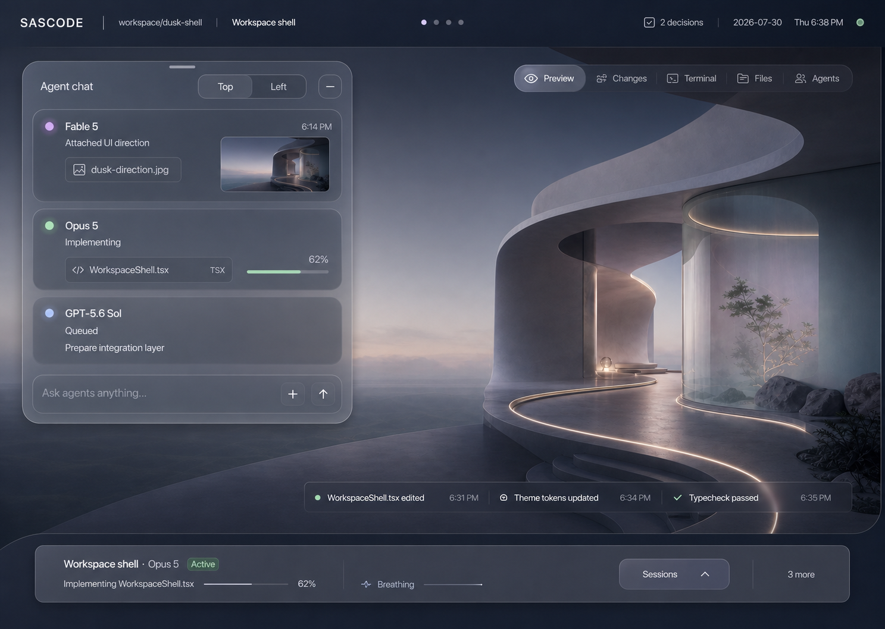
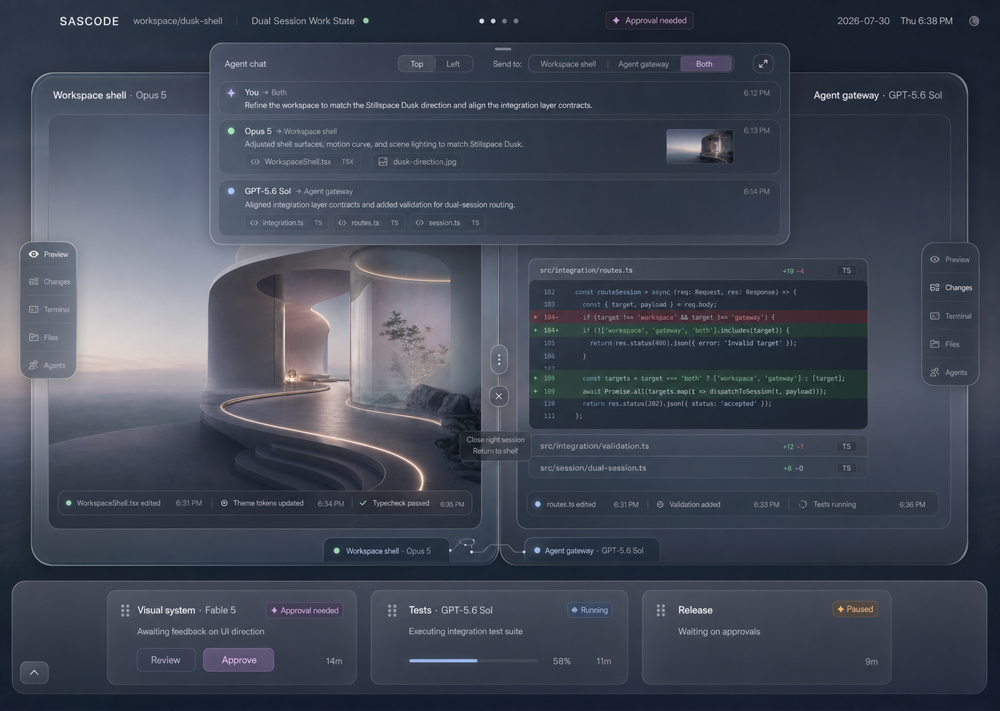
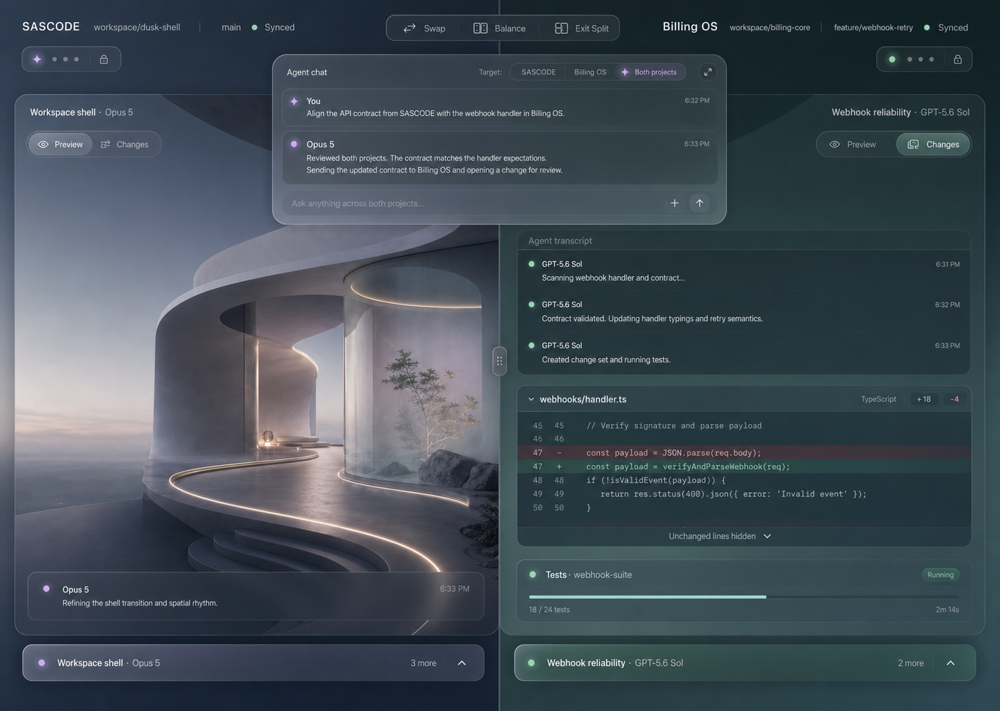
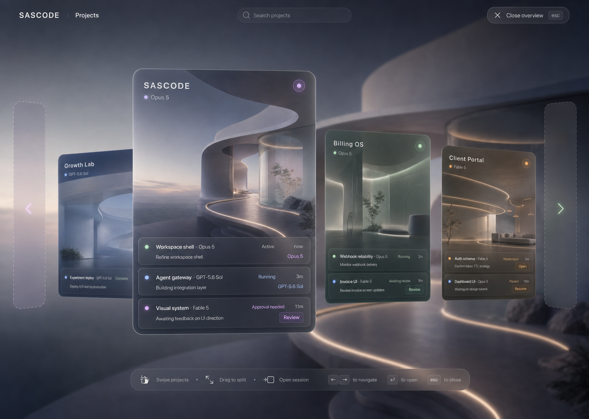
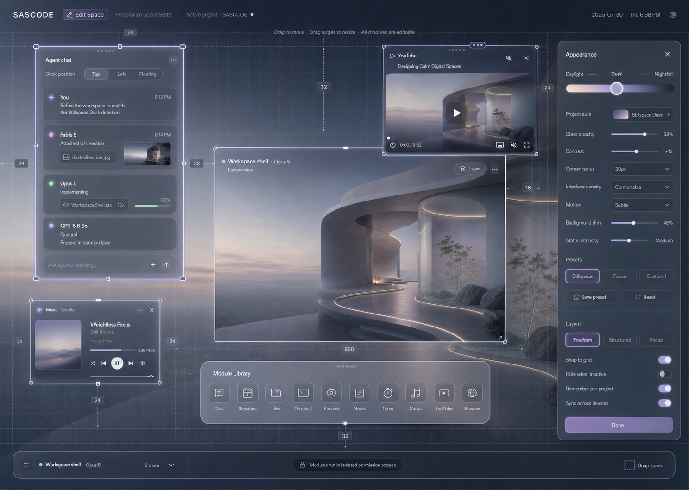
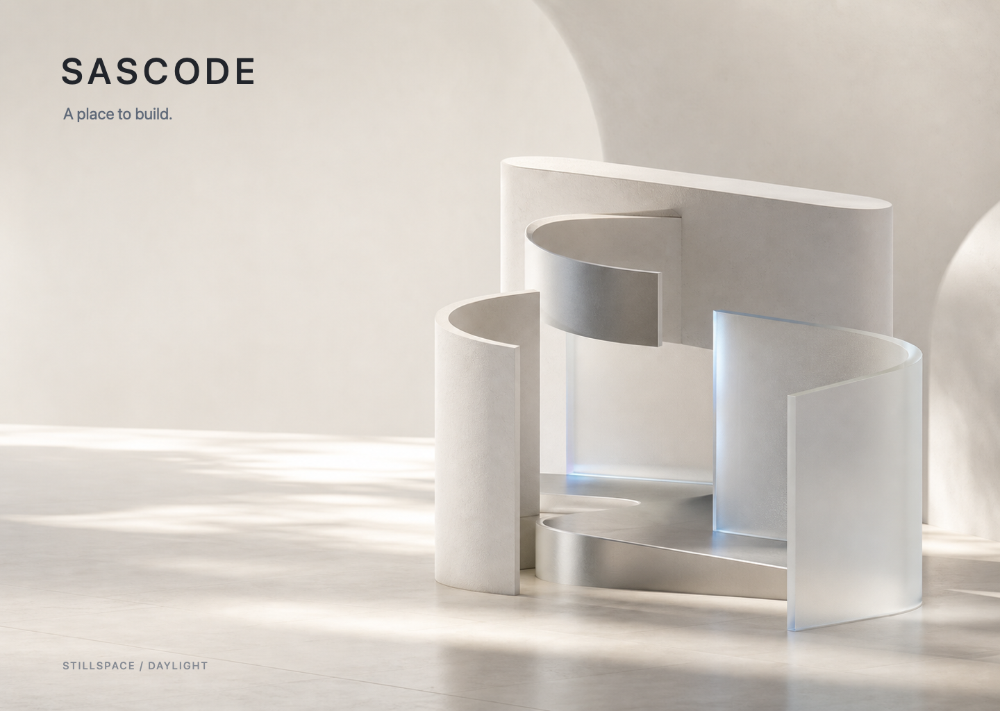
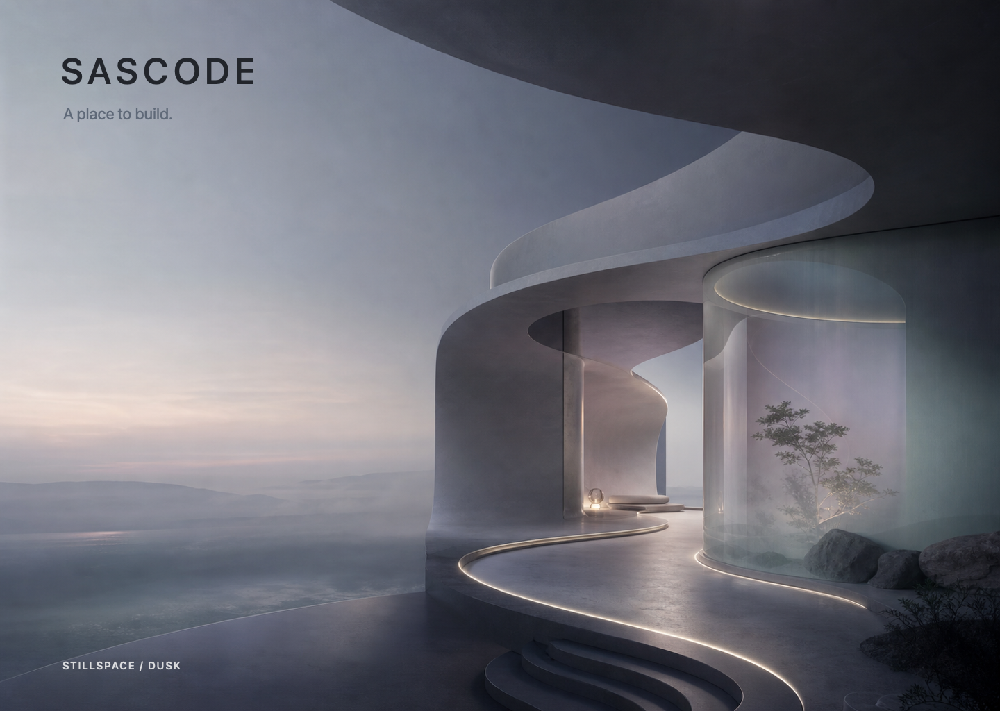
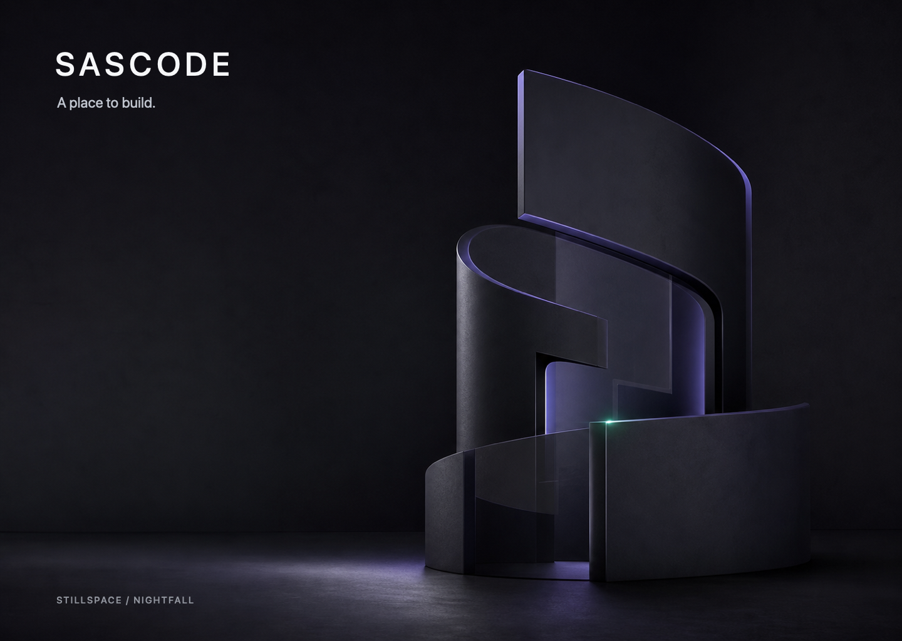

# SASCODE — Product Design, UI/UX, and Brand Contract

> **Status:** Authoritative design context for the SASCODE frontend.
>
> **Audience:** Claude Code and any designer or engineer implementing the product interface.
>
> **Last updated:** 2026-07-30.

## 1. Purpose of this document

This file defines the intended product experience, interface architecture, brand language, visual system, interaction model, and required UI states for SASCODE.

Read this together with [`PRODUCT_VISION.md`](./PRODUCT_VISION.md), which defines the product strategy, orchestration system, browser architecture, permissions, technical foundation, roadmap, and business model. This file remains the authority for how those capabilities should feel and appear.

Before changing repository code, also read [`AGENTS.md`](./AGENTS.md). It preserves the inherited engineering conventions, verification rules, package boundaries, and reliability requirements from the Synara foundation. `AGENTS.md` governs implementation discipline; this file governs SASCODE’s product experience and frontend.

Treat this as a design contract, not as loose inspiration.

- Preserve the interaction architecture and hierarchy described here.
- Use the attached reference images to understand atmosphere, proportions, materials, and intended states.
- Refine spacing, legibility, and component details where necessary.
- Do not reinterpret SASCODE into a conventional IDE, chat app, dashboard, or project-management interface.
- Do not introduce a permanent left navigation sidebar for projects or sessions.
- Do not invent backend behavior. Backend services and orchestration contracts will be developed separately. Keep frontend data access behind clear typed adapters.

The frontend may initially use realistic local fixtures, but its structures must be ready to consume live backend events later.

---

## 2. Product idea

SASCODE is a premium, multi-model software-building environment for people running multiple projects and multiple AI coding sessions simultaneously.

It is more than a code harness. It should feel like entering a calm, living digital studio where:

- Every project is its own place.
- Every session is a live object inside that place.
- The user can remain deeply focused without losing awareness of work happening elsewhere.
- AI models can be delegated different responsibilities.
- Tools and controls appear only when they are relevant.
- The environment can be completely rearranged and personalized.

### Brand promise

**SASCODE — A place to build.**

### Internal design mantra

**Quiet by default. Alive when needed.**

### Desired emotional response

SASCODE should make the user feel:

- Calm rather than stimulated.
- Oriented rather than managed.
- In control rather than monitored.
- Accompanied by intelligence rather than surrounded by bots.
- Comfortable after eight hours of focused work.
- As though they are entering a personal studio, not opening another developer tool.

---

## 3. Non-negotiable product architecture

### 3.1 A project is an entire workspace

A project is not an item stored in a sidebar. It is an entire full-screen spatial environment.

Moving between projects should feel similar to moving between macOS Spaces:

- A three-finger horizontal swipe moves between project workspaces.
- The entire environment moves, not merely the central content.
- Each project may have a restrained ambient aura color for spatial recognition.
- The next and previous project may appear only as subtle edge reveals while focused.
- Project state remains live while the user works in another project.

### 3.2 Three-finger project overview

A three-finger upward gesture opens a temporary project overview.

The overview:

- Pulls the camera back smoothly.
- Shows all projects as large living spatial cards.
- Displays the most important active sessions within each project.
- Allows immediate entry into a project.
- Allows direct entry into a specific session.
- Allows a project card to be dragged to an edge to create a dual-project workspace.
- Is temporary and must never resemble the default home dashboard.

### 3.3 Sessions belong to projects

Sessions are rectangular, rounded, live sheets within a project.

Each session card may show:

- Session name.
- Active model or agent.
- Current state.
- One concise current action.
- Elapsed time.
- A restrained progress indication when useful.
- Contextual approval actions when a decision is required.

Session cards must not become generic dashboard cards. They are draggable working objects.

### 3.4 One or two sessions inside a project

The user can:

- Drag one session into the center to open it.
- Drag a second session into the center to enter dual-session mode.
- Resize the divider between the sessions.
- Address either session or both through the shared chat surface.
- Return a session to the shelf without terminating it.

Dual-session mode keeps each session’s context, model, tools, and state separate.

### 3.5 Two projects simultaneously

The user can drag a project card toward the left or right edge from the project overview to enter dual-project mode.

In this mode:

- Each side is an independent project environment.
- Each project has its own active session and session shelf.
- Each side can be resized.
- The shared chat can target the left project, right project, or both.
- Projects may exchange selected artifacts through an explicit handoff action.
- The user can swap sides, balance the split, or exit split mode.

### 3.6 Progressive disclosure

Power must not require permanent chrome.

Files, changes, diff, terminal, preview, agents, approvals, history, settings, and module controls appear:

- When invoked.
- When hovered or approached.
- When a state requires user attention.
- As temporary contextual layers.

They should disappear or collapse when no longer needed.

The default work state must remain visually quiet.

---

## 4. Product vocabulary

Prefer this vocabulary consistently:

| Concept | Preferred term |
|---|---|
| Full project environment | Project space or workspace |
| AI coding conversation | Agent chat |
| Concurrent unit of work | Session |
| Session representation | Live session card or live sheet |
| Temporary tool selector | Context lens |
| Project switcher | Project overview |
| Customization mode | Edit Space |
| Cross-model transfer | Handoff |
| Required user decision | Approval |
| Light theme | Daylight |
| Intermediate theme | Dusk |
| Dark theme | Nightfall |

Avoid terms such as dashboard, control center, cockpit, mission control, bot farm, or agent army in the product interface.

---

## 5. Brand system: Stillspace

The SASCODE design language is called **Stillspace**.

Stillspace combines:

- Spatial clarity.
- Quiet intelligence.
- Restrained Liquid Glass.
- Matte, stable work surfaces.
- Environmental light.
- Precise typography.
- Living status at the periphery.

The visual identity should be modern and forward-looking without becoming cyberpunk, playful, or theatrical.

### 5.1 Brand personality

SASCODE is:

- Minimal.
- Elegant.
- Professional.
- Spatial.
- Tactile.
- Intelligent.
- Calm.
- Precise.
- Quietly alive.

SASCODE is not:

- Loud.
- Cute.
- Gamified.
- Neon.
- Robotic.
- Enterprise-gray.
- Dashboard-driven.
- Decorated with generic AI sparkles.

### 5.2 Brand mark direction

The primary identity should be the `SASCODE` wordmark.

The eventual symbol should be based on three offset rounded planes representing:

1. Project.
2. Session.
3. Active work.

The negative space may suggest an abstract `S` or an open doorway.

Avoid:

- Terminal prompts.
- Angle brackets.
- Code braces.
- Robot heads.
- Stars and AI sparkles.
- Generic hexagonal technology marks.

---

## 6. Color and environmental themes

The product supports a continuous theme spectrum rather than only a binary toggle.

### 6.1 Core theme slider

The Appearance drawer must include a continuous slider labeled:

**Daylight — Dusk — Nightfall**

The slider changes:

- Background luminance.
- Glass opacity.
- Surface contrast.
- Ambient project aura.
- Highlight intensity.
- Shadow depth.
- Text contrast.

It should interpolate smoothly between theme positions.

### 6.2 Core tokens

#### Daylight

| Token | Suggested value |
|---|---|
| Canvas | `#F4F5F7` |
| Primary surface | `#FCFCFD` |
| Primary text | `#191B20` |
| Secondary text | `#737984` |
| Glass | Translucent cool white |

#### Dusk

| Token | Suggested value |
|---|---|
| Canvas | `#27303D` |
| Deep canvas | `#171D27` |
| Primary surface | `#343E4D` |
| Primary text | `#F0F2F5` |
| Secondary text | `#AEB5C0` |
| Glass | Mineral blue-gray |

#### Nightfall

| Token | Suggested value |
|---|---|
| Canvas | `#0D0F12` |
| Primary surface | `#15181D` |
| Primary text | `#F2F3F5` |
| Secondary text | `#989EA8` |
| Glass | Translucent smoked graphite |

#### Identity and state

| State | Suggested value |
|---|---|
| SAS Indigo | `#7775F6` |
| Live Mint | `#5BCB9A` |
| Attention Honey | `#E3AF5F` |
| Blocked Coral | `#E57876` |
| Resting Slate | `#7E8590` |

Use semantic colors sparingly. A status dot or narrow illuminated edge is usually enough.

### 6.3 Project aura

Each project may have a low-saturation aura color used for:

- Workspace edge light.
- Project overview card rim.
- Active session status.
- Transition lighting when swiping between spaces.

Aura color must never compromise text contrast or turn the project into a theme park.

---

## 7. Materials

Every material has a semantic role.

| Material | Meaning | Examples |
|---|---|---|
| Matte surface | Stable place or work | Project environment, preview, editor content |
| Liquid Glass | Movable or temporary object | Chat sheet, session shelf, module, drawer |
| Light pulse | Live state | Running session, fresh event, attention |
| Soft depth | Hierarchy | Project overview, dragged object, split placement |

### Liquid Glass rules

1. Glass is reserved for movable, floating, or temporary objects.
2. Text-heavy work surfaces remain opaque enough for prolonged reading.
3. Do not stack glass repeatedly inside glass.
4. Avoid extreme blur that destroys environmental context.
5. Use a fine inner highlight and subtle grain.
6. Use shadows sparingly.
7. Glass opacity must adapt to Daylight, Dusk, and Nightfall.

Suggested characteristics:

- Adaptive blur between 18px and 28px.
- One-pixel inner highlight.
- Very light grain.
- Restrained saturation lift.
- Soft, broad depth shadow only when floating.

---

## 8. Typography and iconography

### Typography

- Use the native system typeface for interface text.
- On macOS, the experience should resolve to SF Pro through the system stack.
- Use a monospaced face such as Geist Mono or Berkeley Mono for code and technical state.
- Body text should normally be 14px–16px.
- Technical labels and code may use 12px–13px.
- Large headings should be rare.
- Use weight, spacing, and position before increasing font size.

The `SASCODE` wordmark should use wide architectural tracking.

### Voice and microcopy

Use calm, concise language:

- `Ready for review`
- `Needs your decision`
- `Running tests`
- `Waiting for handoff`
- `2 decisions ready`
- `Return to shelf`

Avoid:

- `Awesome!`
- `Magic complete`
- `Your AI crushed it`
- Excessive exclamation marks.
- Anthropomorphic model chatter.

### Icons

- Use a consistent, fine-line icon family.
- Icons should be monochrome by default.
- Color should communicate state, not decorate icons.
- Avoid large model avatars.
- Avoid emoji.
- Avoid brand logos unless the connected service requires identification.

---

## 9. Shape language

The core shape is a rectangular **live sheet** with continuous rounded corners.

Suggested radii:

| Element | Radius |
|---|---|
| Project overview card | 22px–28px |
| Movable chat or module | 18px–24px |
| Live session card | 16px–20px |
| Context surface | 14px–18px |
| Input or control | 10px–14px |

Do not turn every control into a pill.

Pills are reserved for:

- Small state labels.
- Compact segmented controls.
- Gesture handles.
- Temporary contextual actions.

---

## 10. Primary interface elements

### 10.1 Project environment

The project environment fills the entire application.

It provides:

- Ambient project identity.
- The active session work surface.
- Edge reveals for neighboring projects.
- Project-space position indicator.
- Temporary context layers.
- Session shelf.

For the canonical Stillspace Dusk preset, use the supplied architectural background as the literal default environment. It is the baseline that supplies depth, softness, mineral color, indirect light, and calm geometry. Do not replace it with procedural gradients during the fidelity rebuild.

Users may later select or generate their own project background, and accessibility settings may replace it with a flat surface.

### 10.2 Agent chat

Agent chat is a draggable, resizable, highly visual glass sheet.

It can dock:

- Across the top.
- Along the left side.
- As a floating surface.

It can target:

- The active session.
- Either session in dual-session mode.
- Both sessions.
- Either project in dual-project mode.
- Both projects.

The chat should favor:

- Visual references.
- File chips.
- Tool activity.
- Compact progress.
- Approvals.
- Concise text.

Avoid long stacks of chat bubbles and large repetitive model cards.

### 10.3 Active session surface

The active session surface is the main place where work becomes visible.

Depending on the task, it may emphasize:

- Live preview.
- Agent conversation.
- Code changes.
- Terminal output.
- Files.
- Review decisions.

Only the currently useful representation should dominate.

### 10.4 Context lens

The context lens provides access to:

- Preview.
- Changes or Diff.
- Terminal.
- Files.
- Agents.
- History when required.

The lens is compact and temporary. Selecting a tool opens a contextual layer or transforms the active session surface.

It is not a permanent navigation rail.

### 10.5 Session shelf

The session shelf appears along the bottom of a project.

Default focused state:

- Collapsed.
- Shows the active session.
- Shows a count such as `3 more`.
- Reveals a clear but restrained `Sessions` handle.

Expanded state:

- Shows live rectangular session cards.
- Supports horizontal movement.
- Supports drag to center.
- Supports drag to another placement.
- Surfaces approval buttons only where needed.

The shelf should fade or collapse automatically when the user returns to focused work.

### 10.6 Approval actions

Approvals are contextual, not a permanent inbox.

A session needing input may reveal:

- `Review`
- `Approve`
- `Open`
- `Reject`
- `Request changes`

Actions should become more visible as the pointer approaches or the session becomes urgent.

---

## 11. Required UI states

All states below belong to one application and one design system. They are not competing versions.

### 11.1 Dusk workspace foundation

Purpose:

- Establish the spatial project environment.
- Show draggable agent chat.
- Show live preview as primary work.
- Show expanded session shelf.
- Show contextual approvals.

Reference:



### 11.2 Official focus state

Purpose:

- Represent the default long-duration work mode.
- Keep session shelf collapsed.
- Hide drag handles and customization chrome.
- Show one active session.
- Preserve quiet project awareness.

Reference:



### 11.3 Dual-session state

Purpose:

- Show two sessions in the same project.
- Keep session contexts and model identities separate.
- Allow the shared chat to target left, right, or both.
- Allow resizing, closing, and returning a session to the shelf.

Reference:



### 11.4 Dual-project state

Purpose:

- Show two independent project environments.
- Allow shared or individual chat targeting.
- Provide explicit cross-project artifact handoff.
- Preserve separate project auras and session shelves.

Reference:



### 11.5 Project overview state

Purpose:

- Reveal projects through a three-finger upward gesture.
- Display projects as spatial cards with nested live sessions.
- Support fast project or session switching.
- Support drag-to-split.

Reference:



### 11.6 Personalize Space state

Purpose:

- Allow complete layout customization.
- Make every module draggable and resizable.
- Configure environmental theme.
- Add optional productivity and media modules.
- Save layouts and presets.

Reference:



---

## 12. Full customization and Edit Space

Users must be able to customize the entire project workspace.

Customization applies to:

- Position.
- Size.
- Docking.
- Layer order.
- Visibility.
- Opacity.
- Corner radius.
- Interface density.
- Theme.
- Project aura.
- Motion intensity.
- Background dimming.
- Status intensity.

### Edit Space behavior

When Edit Space is active:

- A subtle alignment grid appears.
- Magnetic snap guides appear.
- Spacing measurements may appear.
- Resize handles become visible.
- Dock targets appear near valid edges.
- A temporary Module Library becomes available.
- The Appearance drawer may remain open.

When Edit Space is closed:

- All editing chrome disappears.
- The final workspace returns to a calm work state.

### Layout presets

Initial presets:

- `Stillspace`
- `Focus`
- `Custom 1`

Initial layout modes:

- `Freeform`
- `Structured`
- `Focus`

Settings:

- Snap to grid.
- Hide when inactive.
- Remember per project.
- Sync across devices.
- Save preset.
- Reset.

### Suggested persisted layout model

The exact backend schema will be defined separately, but the frontend should be designed around a serializable layout model:

```ts
type WorkspaceLayout = {
  version: number;
  projectId: string;
  theme: ThemeSettings;
  mode: "focus" | "dual-session" | "dual-project" | "edit-space";
  modules: WorkspaceModulePlacement[];
  activeSessionIds: string[];
};

type WorkspaceModulePlacement = {
  id: string;
  type:
    | "agent-chat"
    | "session-shelf"
    | "files"
    | "terminal"
    | "preview"
    | "notes"
    | "timer"
    | "music"
    | "youtube"
    | "browser";
  x: number;
  y: number;
  width: number;
  height: number;
  dock?: "top" | "left" | "right" | "bottom" | "floating";
  zIndex: number;
  hiddenWhenInactive: boolean;
  permissionScope?: string[];
};

type ThemeSettings = {
  spectrum: number; // 0 = Daylight, 0.5 = Dusk, 1 = Nightfall
  projectAura: string;
  glassOpacity: number;
  contrast: number;
  cornerRadius: number;
  density: "compact" | "comfortable" | "spacious";
  motion: "reduced" | "subtle" | "expressive";
  backgroundDim: number;
  statusIntensity: number;
};
```

Do not couple rendering to a specific persistence mechanism.

---

## 13. Optional modules and integrations

The workspace can accept optional modules.

Initial module library:

- Chat.
- Sessions.
- Files.
- Terminal.
- Preview.
- Notes.
- Timer.
- Music.
- YouTube.
- Browser.

### Music module

The Music module may connect to Spotify or another provider.

It should support:

- Album art.
- Track and artist.
- Play or pause.
- Previous and next.
- Progress.
- Volume.
- Provider identity.

It must remain visually secondary to work.

### YouTube module

The YouTube module may support:

- Embedded playback.
- Pause and resume.
- Mute.
- Picture-in-picture.
- Close.
- Resize.
- Reposition.

It should never autoplay with sound.

### Module security

Modules must use isolated permission scopes.

The interface should communicate:

`Modules run in isolated permission scopes.`

The frontend must be prepared to display:

- Requested permissions.
- Active permissions.
- Revocation controls.
- Network and filesystem boundaries.

Backend sandboxing and integration security will be specified separately.

---

## 14. Gestures and direct manipulation

| Gesture or action | Result |
|---|---|
| Three-finger swipe left or right | Move between project spaces |
| Three-finger swipe upward | Open project overview |
| Click project card | Enter project |
| Drag project card to an edge | Enter dual-project mode |
| Drag session card to center | Open session |
| Drag second session to center | Enter dual-session mode |
| Drag session back toward shelf | Return session to shelf |
| Drag divider | Resize split |
| Drag chat sheet | Reposition or dock chat |
| Resize module edges or corners | Resize module |
| Escape | Close temporary layer or overview |

Every gesture must also have:

- A keyboard equivalent.
- A pointer equivalent.
- A discoverable but non-intrusive affordance.

Do not make the product unusable without a trackpad.

---

## 15. Motion

Motion explains spatial relationships.

Suggested timing:

| Transition | Timing |
|---|---|
| Small control or hover | 140ms–200ms |
| Module reveal | 220ms–320ms |
| Session drag snap | 260ms–380ms |
| Project swipe | 420ms–560ms |
| Project overview pullback | 420ms–520ms |
| Enter or exit split | 360ms–480ms |

Motion principles:

- Preserve object continuity.
- Use restrained spring behavior.
- Avoid playful bounce.
- Avoid endless ambient loops.
- Use one soft pulse for fresh state.
- Let live status settle.
- Respect reduced-motion settings everywhere.

---

## 16. Accessibility and long-duration comfort

SASCODE must be usable for prolonged focus.

Requirements:

- Maintain WCAG-appropriate contrast in every theme position.
- Do not rely on color alone for state.
- Support keyboard navigation for every draggable action.
- Provide visible focus states.
- Support reduced transparency.
- Support reduced motion.
- Provide high-contrast mode.
- Keep body text at a comfortable readable size.
- Avoid flashing or continuously pulsing status.
- Allow users to reduce background imagery or replace it with a flat surface.
- Keep video paused by default.
- Keep audio muted until explicitly played.

Customization must never allow the user to make essential controls inaccessible without a recovery method.

Always provide:

- Reset layout.
- Restore default theme.
- Recover off-screen modules.
- Exit Edit Space.

---

## 17. Frontend implementation principles for Claude

### Treat the references correctly

- During the current visual recovery, the selected reference image is a binding composition target at its native viewport.
- Match its major anchors, proportions, atmosphere, hierarchy, and material behavior before extrapolating.
- Do not reinterpret the reference as a mood board or replace source assets with procedural approximations.
- Readability and accessibility corrections are allowed only when they do not erase the selected composition.
- Preserve the interaction architecture.
- Do not simplify the product back into a sidebar.

### Recommended frontend boundaries

Keep these concerns separable:

- Project space navigation.
- Session state and session shelf.
- Agent chat.
- Context lens and temporary tools.
- Split layout engine.
- Edit Space layout engine.
- Theme interpolation.
- Module host and permissions UI.
- Backend event adapter.

### Backend boundary

The SASCODE backend is implemented. Read `BACKEND_HANDOFF.md` before changing
the renderer.

The canonical frontend client is:

```ts
const sascode = ensureNativeApi().sascode;
```

Its stable typed contract is `SascodeClientApi` in
`packages/contracts/src/sascode/api.ts`. The Effect RPC group is registered in
`packages/contracts/src/rpc.ts`; the WebSocket adapter is complete in
`apps/web/src/wsNativeApi.ts` and `apps/web/src/wsTransport.ts`.

Frontend code must:

- Consume the real typed API and normalized Synara orchestration state.
- Use the Director event subscription for replay-then-live workflow updates.
- Use TanStack Query or focused adapters around `NativeApi.sascode`.
- Keep mock fixtures inside tests, stories, or explicit development previews.
- Avoid embedding orchestration, readiness, routing, permission, retry, or
  workflow-completion rules in UI components.
- Avoid hard-coding model behavior or assuming one provider.
- Treat each connected subscription account as a distinct provider connection;
  never collapse several Claude, Codex, Gemini, or other accounts into one
  global toggle.
- Treat routing decisions, permission decisions, attention snapshots, browser
  ownership, module activation, and layout revisions as backend truth.
- Preserve the existing chat, terminal, diff, Git, browser, provider,
  authentication, settings, diagnostics, and recovery capabilities while
  replacing the primary navigation shell.

Implemented data domains include:

- Projects and sessions.
- Workflows, work units, attempts, and provider threads.
- Agents, providers, models, routing policies, routing decisions, and overrides.
- Unlimited provider-account pools, account health/priority, per-session
  affinity, and explicit account handoff.
- Tool calls, file changes, approvals, user input, and handoffs.
- Context, evidence, quality gates, and immutable result packets.
- Live Director events and cross-project attention.
- Durable layouts and Stillspace theme settings.
- Permission grants, boundaries, step-up outcomes, and audit records.
- Browser profiles, instances, ownership, and evidence.
- Module manifests, instances, permissions, and placement state.

Do not create a parallel frontend-only backend model. `BACKEND_HANDOFF.md`
defines the required joins, lifecycle, API surface, recovery behavior, and
known adapter boundaries.

### Performance

- Keep animation at 60fps where possible.
- Avoid excessive live backdrop blur.
- Virtualize long histories.
- Suspend hidden project rendering where appropriate while preserving live state.
- Lazy-load optional media modules.
- Do not allow background video to consume resources when hidden.

---

## 18. Reference library

### Branding and atmosphere

#### Daylight

Use for:

- Bright end of the appearance spectrum.
- Porcelain surfaces.
- Quiet clarity.



#### Dusk

This is the primary SASCODE external brand atmosphere.

Use for:

- Default product identity.
- Mineral atmosphere.
- Warm silver.
- Calm architectural depth.
- Balanced light and dark.



#### Nightfall

Use for:

- Dark end of the appearance spectrum.
- Graphite focus mode.
- Restrained luminosity.



#### Raw Dusk background reference

Use this exact image as the default background for the canonical Stillspace Dusk preset and visual acceptance fixtures.

The product may support custom, generated, reduced, or flat project backgrounds, but those options do not replace the default asset during the fidelity rebuild.


---

## 19. Explicit anti-patterns

Do not implement:

- A permanent left sidebar containing projects and sessions.
- A dashboard as the default screen.
- A conventional IDE with every panel visible simultaneously.
- A card grid where every feature has equal visual weight.
- KPI counters and charts used as decoration.
- A chatbot column permanently consuming the full height.
- Oversized model avatars.
- AI sparkle icons repeated throughout the interface.
- Neon cyberpunk styling.
- Gamer UI.
- Glass on every surface.
- Cards nested repeatedly inside cards.
- Excessively rounded toy-like controls.
- Constant animation.
- Unnecessary notification feeds.
- A literal clone of macOS or Apple branding.

---

## 20. Definition of a successful first frontend

The first coherent frontend should demonstrate:

- A full-screen project space.
- Three-finger-style project navigation with pointer and keyboard fallbacks.
- Project overview.
- Draggable and dockable visual agent chat.
- Live session shelf.
- Session approval actions.
- Single-session focus state.
- Dual-session mode.
- Dual-project mode.
- Context lens with at least Preview, Changes, Terminal, Files, and Agents.
- Edit Space.
- Draggable and resizable modules.
- Daylight–Dusk–Nightfall theme slider.
- Persistable layout model.
- Music and YouTube module prototypes.
- Accessibility fallbacks.
- Realistic mock events behind typed adapters.

The product is successful when it feels:

- Spatial without being confusing.
- Powerful without displaying all power at once.
- Alive without being distracting.
- Premium without being decorative.
- Customizable without becoming chaotic.
- Comfortable enough to inhabit.
