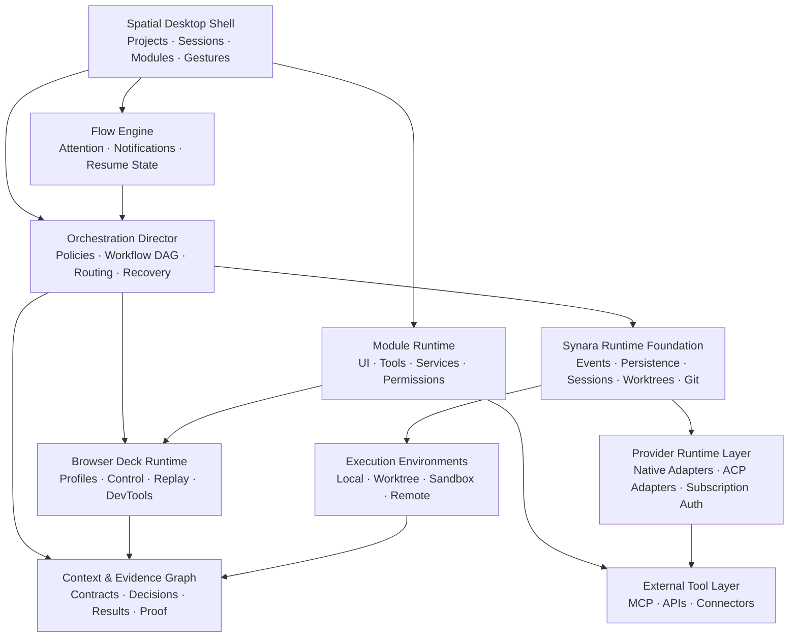

# SASCODE — Product Vision and Architecture Direction

> A spatial operating system for building software with AI.

- **Document status:** Founding product contract
- **Research date:** 30 July 2026
- **Product name:** SASCODE
- **Foundation:** A commercial, independently branded fork of Synara
- **Design authority:** [`CLAUDE.md`](./CLAUDE.md)
- **Audience:** Founder, product designer, frontend implementer, backend implementer, future contributors, and future investors

---

## 1. Purpose of this document

This document defines what SASCODE is, why it should exist, what it should own, what it should inherit from Synara, and what must be built to turn the idea into a defensible public product.

It is not a screen-by-screen design specification. The visual system, interaction language, themes, spatial navigation, session cards, gestures, and reference imagery are already defined in [`CLAUDE.md`](./CLAUDE.md).

The two documents have different jobs:

- `CLAUDE.md` is the authority for brand, aesthetics, UI, UX, motion, layout, and frontend behavior.
- `PRODUCT_VISION.md` is the authority for product strategy, market position, feature hierarchy, orchestration, browser architecture, security, technical direction, roadmap, and business model.

When the two documents appear to conflict:

1. `PRODUCT_VISION.md` decides what the product must do.
2. `CLAUDE.md` decides how that product should feel and appear.
3. Neither document authorizes implementation shortcuts that compromise user data, project isolation, accessibility, or recoverability.

---

## 2. The vision

### 2.1 One-sentence vision

SASCODE is the most beautiful, coherent, and adaptable place to direct AI agents across every stage of building software.

### 2.2 Long-term vision

One person should be able to operate a portfolio of software projects with the leverage of an excellent multidisciplinary team without losing:

- product intent;
- design quality;
- architectural coherence;
- awareness of parallel work;
- control over permissions;
- confidence in what changed;
- or the calm required for deep work.

The user should not have to think in terms of separate terminals, provider apps, IDE windows, browser windows, model chats, dashboards, and project-management tabs. Those are implementation details.

The user should think in terms of:

- a project;
- an intention;
- the work currently happening;
- decisions requiring attention;
- the evidence that the result is correct;
- and the next useful move.

### 2.3 The category

SASCODE is not merely:

- an IDE;
- a chat client;
- a multi-model picker;
- a worktree manager;
- a project dashboard;
- an agent terminal wrapper;
- or a customizable desktop.

The category SASCODE should create is:

> **AI Software Creation OS**

It is an operating environment for directing models, agents, tools, browsers, code, context, and approvals across many projects.

### 2.4 Brand-level product promise

> Open a project. State the outcome. SASCODE assembles the right intelligence, tools, context, and verification around the work while protecting your focus.

### 2.5 Emotional promise

SASCODE should feel like entering a quiet, intelligent studio that already understands how the user works.

It should feel:

- calm rather than empty;
- capable rather than complicated;
- alive rather than busy;
- personal rather than configured;
- professional rather than corporate;
- and powerful without constantly advertising its power.

This is why SASCODE is “beyond a code harness and more of a place.”

---

## 3. The founder thesis

The product is based on six beliefs.

### 3.1 Models will remain heterogeneous

No single model or provider will be best at every activity. A builder may prefer one model for product thinking, another for visual design, another for frontend execution, another for backend implementation, and another for review.

The correct abstraction is therefore not “choose one model.” It is:

> Define the kind of work, then resolve the best available agent for that work under the user’s preferences and constraints.

### 3.2 The interface changes the quality of AI work

Model capability is only one part of the outcome. Context, tools, task shape, permissions, handoffs, evidence, and the user’s ability to supervise work all affect quality.

T3 Code describes itself as an open-source control plane for coding agents and explicitly supports changing the UI, adding agents, and distributing a derivative. This validates the control-surface thesis, but SASCODE must go beyond a control surface into a coherent work environment. See [T3 Code](https://t3.codes/) and its [architecture overview](https://github.com/pingdotgg/t3code/blob/main/docs/architecture/overview.md).

### 3.3 Parallelism without legibility becomes chaos

Running more agents is not the goal. Producing more accepted, integrated, high-quality work is the goal.

Parallel work must therefore have:

- isolated environments;
- explicit dependencies;
- visible ownership;
- bounded file scopes;
- conflict detection;
- meaningful progress states;
- structured results;
- and a controlled integration path.

### 3.4 Focus is a product capability

Developers maintain rich mental models of their code and spend real effort recovering those models after interruptions. Microsoft research identified task switching and recovering implicit knowledge as serious developer problems, while Google research treats flow and friction as meaningful dimensions of developer productivity. See [Software Development at Microsoft Observed](https://www.microsoft.com/en-us/research/publication/software-development-at-microsoft-observed/), [Maintaining Mental Models](https://www.microsoft.com/en-us/research/publication/maintaining-mental-models-a-study-of-developer-work-habits/), and [Measuring Flow and Friction for Developers](https://research.google/pubs/measuring-flow-and-friction-for-developers-part-6-measuring-flow-and-friction-for-developers/).

SASCODE must manage attention, not merely display activity.

### 3.5 The browser is part of software development

Modern software work continuously crosses code and browser boundaries:

- reading documentation;
- inspecting APIs;
- authenticating services;
- using admin consoles;
- testing a local application;
- reviewing responsive behavior;
- checking analytics;
- operating deployments;
- and validating production.

A single passive preview pane is insufficient. The browser must be a first-class, observable, controllable environment shared by the user and agents.

### 3.6 Taste can be operationalized

The user’s design preferences should not live only in prompts or memory. They should become durable, versioned, inspectable product constraints that follow work across sessions and models.

SASCODE should treat taste as part of the project specification.

---

## 4. Target user

### 4.1 Primary user

The primary user is a design-led technical founder or independent product builder who:

- builds SaaS applications, AI automations, internal tools, and software products;
- works across several projects at once;
- runs several agent sessions inside each project;
- pays for multiple AI subscriptions;
- has strong preferences about which models perform which work;
- cares deeply about UI, UX, polish, and product coherence;
- wants high autonomy but not invisible or uncontrolled autonomy;
- and does not want to live inside a terminal or a traditional IDE layout.

### 4.2 Secondary users

Later audiences include:

- small product teams;
- AI-native agencies;
- design engineers;
- technical product managers who build with agents;
- founders who can direct systems but do not want to hand-code every layer;
- and enterprise teams that need provider choice, governance, and auditability.

### 4.3 Jobs to be done

The user hires SASCODE to:

1. Hold the state of many projects without making them mentally active at the same time.
2. Start, observe, steer, and review many agent sessions from one place.
3. Automatically give each part of a feature to an appropriate model.
4. Preserve design and architecture decisions across providers and context windows.
5. Let agents use the same browser the user can see and take over.
6. Keep terminals, previews, diffs, documentation, data, deployment, and collaboration close without permanently crowding the screen.
7. Continue work when a provider hits a usage limit or becomes unavailable.
8. Prove that work is ready before it is integrated or shipped.
9. Personalize the environment until it feels like the user’s own studio.
10. Build and improve SASCODE using SASCODE itself.

---

## 5. Positioning

### 5.1 Positioning statement

For design-led builders operating multiple AI subscriptions and multiple software projects, SASCODE is a spatial AI software creation environment that plans, delegates, executes, verifies, and integrates work across the best available agents.

Unlike terminal-first agents, editor-first copilots, and thread dashboards, SASCODE:

- organizes work around project environments rather than a sidebar hierarchy;
- treats model selection as a transparent policy;
- carries structured context and evidence between agents;
- makes multiple browsers part of the agent runtime;
- adapts the interface to the current need;
- and protects the user’s attention while parallel work continues.

### 5.2 The memorable difference

Other products help the user run agents.

SASCODE should help the user **conduct software creation**.

### 5.3 What SASCODE is not trying to win

SASCODE does not need to become:

- the deepest manual code editor;
- the provider of a proprietary foundation model;
- the cheapest token reseller;
- a replacement for Git;
- an all-purpose operating system;
- or a generic project-management suite.

It wins by making heterogeneous AI work coherent, beautiful, safe, and verifiable.

---

## 6. Market research and opportunity

### 6.1 What the market already proves

The market has already validated several parts of the idea:

- T3 Code proves demand for an open, subscription-friendly control plane with model switching and agent branches. See [T3 Code](https://t3.codes/).
- Synara proves demand for a local-first workspace combining providers, worktrees, split chats, terminals, browser previews, handoffs, PRs, automations, and agent-driven app control. See [Synara](https://www.trysynara.com/), its [repository](https://github.com/Emanuele-web04/synara), and [External MCP integration](https://github.com/Emanuele-web04/synara/blob/main/docs/external-mcp.md).
- Conductor proves that a workspace, branch, environment, and review path are a useful unit of independent agent work. See [Conductor’s parallel-agent model](https://www.conductor.build/docs/concepts/parallel-agents) and [workflow](https://www.conductor.build/docs/concepts/workflow).
- OpenCode proves demand for broad provider support, per-agent models, per-agent tools, and fine-grained permissions. See [OpenCode providers](https://opencode.ai/docs/providers) and [OpenCode agents](https://opencode.ai/docs/agents).
- Claude Code and Codex prove that specialized subagents, isolated contexts, model-specific agent definitions, worktrees, hooks, browser tooling, and permissions are becoming standard primitives. See [Claude Code custom subagents](https://code.claude.com/docs/en/sub-agents), [Claude Code hooks](https://code.claude.com/docs/en/agent-sdk/hooks), [Codex subagents](https://learn.chatgpt.com/docs/agent-configuration/subagents.md), and [Codex worktrees](https://learn.chatgpt.com/docs/environments/git-worktrees.md).
- Agent Client Protocol proves that editors and agents can be decoupled through an open interoperability layer. See the [ACP introduction](https://agentclientprotocol.com/get-started/introduction) and [Zed’s ACP overview](https://zed.dev/acp).
- Browserbase, Stagehand, and Playwright MCP prove that visible, persistent, inspectable, agent-controlled browsers can be embedded into larger products. See [Browserbase Live View](https://docs.browserbase.com/platform/browser/observability/session-live-view), [Browserbase observability](https://docs.browserbase.com/platform/browser/observability/observability), [Stagehand observe](https://docs.stagehand.dev/v3/basics/observe), and [Playwright MCP](https://github.com/microsoft/playwright-mcp).

SASCODE does not need to invent these primitives. It needs to integrate them around a more complete product model.

### 6.2 Competitive landscape

| Product or category | What it does well | Gap relative to SASCODE |
|---|---|---|
| Claude Code | Deep repository work, configurable subagents, hooks, permissions, sandboxing, MCP | Claude-centric surface; no spatial multi-project environment or provider-neutral orchestration policy |
| Codex | Strong agent execution, subagents, worktrees, browser/computer use, durable customization | Primarily OpenAI model ecosystem; not a cross-provider studio whose core job is coordinating subscription agents |
| T3 Code | Open control plane, bring-your-own subscription, mid-thread switching, branches and PRs, MIT forkability | Control-surface and thread orientation; no taste-aware spatial OS, context graph, or complete workflow router |
| Synara | Best current foundation: many harnesses, local-first state, worktrees, handoffs, Agent Gateway, automations, PRs, visible browser | Still uses conventional project/thread navigation; delegation is available but not yet a full user-authored, policy-driven production system |
| Conductor | Excellent isolated workspaces, parallel agents, review and merge lifecycle | Workspace manager first; limited model-stage orchestration, spatial customization, and integrated browser/module vision |
| OpenCode | Broad model/provider support and explicit per-agent permissions | Terminal-oriented experience and provider setup; not a design-led portfolio workspace |
| Cursor | Editor integration, background agents, remote handoff, tools and MCP | Editor-first, vendor surface, and remote-agent model constraints; not subscription-harness orchestration across a portfolio |
| Windsurf | Agent planning, memories/rules, preview feedback, deployment workflow | Editor-first and visually conventional; workflows and model choice do not form a provider-neutral stage graph |
| Amp | Multi-model strategy, subagents, oracle second opinion, thread sharing | Model selection is intentionally opinionated; not designed as a fully user-controlled multi-subscription spatial environment |
| Emerging agent-first IDEs | Products increasingly bundle worktrees, agents, browser, database, diff, and terminal | Bundling surfaces does not solve model policy, attention, evidence, context transfer, or a non-dashboard spatial hierarchy |

Cursor’s own documentation notes that background agents run in isolated remote machines with internet access and auto-run commands, which illustrates both the utility and the trust risk of autonomous environments. See [Cursor Background Agents](https://docs.cursor.com/background-agent).

Windsurf can preview a local app, select page elements, capture errors, and send that context to its agent, which validates the importance of a code-to-browser feedback loop. See [Windsurf Previews](https://docs.windsurf.com/windsurf/previews).

Amp’s oracle uses a different model for a second opinion, validating cross-model critique as a useful pattern. See the [Amp Owner’s Manual](https://ampcode.com/manual).

### 6.3 The unresolved market gaps

#### Gap 1: Products are thread-first, not project-environment-first

Most products place projects and chats inside a persistent sidebar. They optimize finding a thread, not inhabiting a project.

SASCODE’s project is an entire environment. Sessions are live objects within it. Other projects remain ambient, not absent.

#### Gap 2: Multi-model usually means manual selection

Model switching exists, but the user still has to know when, where, and why to switch.

SASCODE should turn preferences into routing policy and routing policy into an inspectable workflow.

#### Gap 3: Handoffs are transcript-centric

Passing an entire conversation transfers noise as well as context. It also makes another model reconstruct the task, constraints, decisions, and current state.

SASCODE should hand off structured contracts and results, with the relevant transcript available only as supporting evidence.

#### Gap 4: Browser panes are not browser systems

A preview or one embedded tab does not provide:

- multiple identities;
- isolated profiles;
- concurrent agent control;
- replay;
- devtools evidence;
- human takeover;
- environment labeling;
- or approval-aware web actions.

#### Gap 5: Agent activity is visible at the wrong abstraction

Raw tool calls are useful for debugging but poor for supervising five active sessions.

The user needs to know:

- what outcome the agent is pursuing;
- what phase it is in;
- what changed;
- what is blocked;
- what it needs;
- how confident the system is;
- and what evidence exists.

#### Gap 6: Attention is not modeled as a scarce resource

Most systems notify when something changes. SASCODE should notify when human attention has become the highest-value next action.

#### Gap 7: Quality gates are fragmented

Tests, browser checks, screenshots, reviews, diffs, security scans, and deploy previews exist in separate surfaces. They are rarely assembled into a single definition of done.

#### Gap 8: Customization usually stops at theme and pane layout

SASCODE should let the user compose an environment from modules while preserving a coherent product language and safe capability boundaries.

#### Gap 9: Provider volatility leaks into the user experience

Provider model names, authentication paths, subscription entitlements, limits, and tools change frequently. Current Google documentation and announcements, for example, show movement between Gemini CLI and Antigravity experiences. SASCODE must discover capabilities dynamically rather than hard-code promises. See [Gemini CLI authentication](https://geminicli.com/docs/get-started/authentication/) and [Google AI Ultra benefits](https://support.google.com/googleone/answer/16286513).

#### Gap 10: Taste is not a first-class project dependency

Design references and UI principles are usually temporary prompt context. SASCODE should make them durable and automatically attach them to relevant work.

#### Gap 11: “Never leave the app” products become crowded

Adding every tool as a permanent panel recreates the cognitive overload SASCODE is meant to remove.

The opportunity is not maximum visible functionality. It is maximum available functionality with minimum persistent chrome.

#### Gap 12: Autonomy and trust are treated as opposites

Constant approval causes fatigue. Unlimited access creates unacceptable risk.

SASCODE should use bounded autonomy: agents operate freely inside explicit, inspectable scopes and request step-up approval only when the boundary must expand.

---

## 7. Foundation decision: build on Synara

### 7.1 Decision

SASCODE should begin as a fork of the current Synara repository.

It should not begin:

- as a plugin layered only through External MCP;
- as a cosmetic patch against the installed binary;
- or as a new fork directly from T3 Code.

### 7.2 Why Synara is the correct base

Synara already provides a unusually complete foundation:

- local-first desktop operation;
- direct use of existing provider subscriptions;
- provider discovery and health checks;
- adapters for several agent harnesses;
- cross-provider thread handoffs;
- isolated Git worktrees;
- branch, commit, push, diff, PR, and review workflows;
- terminals and process supervision;
- event-backed orchestration state;
- automations;
- Studio and project containers;
- internal Agent Gateway tools;
- scoped External MCP control;
- provider-native subagent visibility;
- a visible browser that agents can control;
- browser snapshots, interactions, logs, and human handoff behavior;
- thread diagnostics and recovery;
- and a mature test suite.

The current [Synara repository](https://github.com/Emanuele-web04/synara) explicitly describes these surfaces, while its changelog documents the Agent Gateway, project spaces, browser automation, multi-task creation, provider handoffs, and automation lifecycle. See the [Synara changelog](https://www.trysynara.com/changelog).

### 7.3 Licensing

Synara is licensed under MIT. The license permits use, modification, distribution, sublicensing, and sale of copies, provided the copyright and permission notice are retained in copies or substantial portions. See the [Synara license](https://github.com/Emanuele-web04/synara/blob/main/LICENSE).

T3 Code is also MIT licensed and explicitly invites forks and redistribution. See [T3 Code](https://t3.codes/) and the [T3 Code repository](https://github.com/pingdotgg/t3code).

This makes a paid SASCODE derivative feasible, but the product must still:

- retain required copyright and license notices;
- inventory all third-party dependencies and their licenses;
- use independent SASCODE branding and assets;
- avoid implying endorsement by Synara or T3 Code;
- review provider terms governing subscription-driven automation;
- and obtain professional legal review before commercial launch.

This document is a product recommendation, not legal advice.

### 7.4 Why not fork T3 Code directly

T3 Code provides an excellent control-plane foundation, but Synara has already added many of the layers SASCODE would otherwise need to rebuild:

- more provider adapters;
- worktree and session lifecycle hardening;
- Agent Gateway;
- External MCP;
- automations;
- project spaces;
- provider-native task visibility;
- browser automation attached to the visible webview;
- PR review;
- Studio;
- and extensive persistence and recovery behavior.

Forking T3 Code would spend months reproducing infrastructure that already exists in Synara.

### 7.5 Why External MCP alone is insufficient

Synara External MCP is useful for allowing Claude Code, Codex, or another MCP client to create and follow Synara work. It is intentionally scoped and exposes a small tool surface. See [External MCP integrations](https://github.com/Emanuele-web04/synara/blob/main/docs/external-mcp.md).

That is enough to operate Synara from another agent.

It is not enough to:

- replace the interface;
- introduce a new spatial navigation model;
- make workflows first-class persistent objects;
- change the project/session hierarchy;
- add a complete module compositor;
- implement multiple browser instances and profiles;
- or build paid product infrastructure.

Those changes require owning the application source.

### 7.6 Upstream strategy

SASCODE should keep a deliberate relationship with Synara upstream:

1. Fork from a documented Synara commit.
2. Preserve upstream Git history and license notices.
3. Maintain an `upstream/synara` remote.
4. Place SASCODE-specific behavior behind explicit packages and contracts.
5. Avoid unnecessary rewrites of stable provider and persistence code.
6. Regularly inspect upstream security, provider, and runtime fixes.
7. Merge selected upstream changes through ordinary reviewed branches.
8. Never make the commercial product depend on unreviewed upstream auto-merges.

The goal is to inherit infrastructure improvements without allowing upstream structure to dictate SASCODE’s product identity.

---

## 8. Product principles

### 8.1 Project over thread

The primary unit of experience is the project environment.

A session belongs to the project. A tool appears inside the project. A browser has a project identity. A module has project state. The project persists when individual sessions end.

### 8.2 Intent over model

The user starts with an outcome, not a provider decision.

Model controls remain available, but SASCODE can recommend or automatically select the execution route.

### 8.3 Policy over magic

Automatic decisions must be inspectable.

The user should be able to answer:

- Why was this model selected?
- What will it receive?
- What may it modify?
- What happens if it fails?
- What will verify its result?

### 8.4 Progressive disclosure

Everything necessary should be available. Only what is currently useful should be visible.

### 8.5 Ambient awareness over notification

Other projects can communicate state through motion, color, and compact live cards without demanding immediate interaction.

### 8.6 Evidence over confidence language

An agent saying “done” is not completion.

Completion is supported by evidence:

- tests;
- build output;
- visual checks;
- browser state;
- static analysis;
- review;
- or an explicit human acceptance.

### 8.7 Local-first over cloud dependency

Local projects, chats, policies, layouts, and credentials should remain local by default.

Cloud services may add:

- sync;
- remote access;
- hosted browsers;
- team collaboration;
- and durable background execution.

They should not be required for the personal desktop product to function.

### 8.8 Subscriptions first, APIs optional

SASCODE should use authenticated local harnesses when supported so users can benefit from plans they already purchase.

API and gateway connections remain valuable for:

- unsupported models;
- team billing;
- deterministic quotas;
- hosted execution;
- and provider failover.

The product should clearly distinguish subscription usage from metered API usage.

### 8.9 Bounded autonomy over unrestricted access

Agents should have enough authority to finish normal work within their assigned environment.

Authority should expand through explicit capability scopes, not a global “anything forever” switch.

### 8.10 Beauty is functional

Visual calm, motion discipline, spatial consistency, and long-session comfort directly affect supervision and focus. They are not decoration.

---

## 9. The product model

SASCODE should use a clear hierarchy.

### 9.1 Portfolio

The collection of all projects available to the user.

The portfolio is not rendered as a conventional dashboard. It is revealed spatially through the project overview gesture or an intentional command.

### 9.2 Project environment

A persistent world containing:

- repository or working folder;
- project charter;
- design contract;
- sessions;
- worktrees;
- browsers;
- terminals;
- modules;
- decisions;
- environment connections;
- and project-specific layout.

### 9.3 Session

A conversation and execution relationship with one active agent runtime.

A session has:

- one project;
- one provider connection;
- one selected model at a time;
- one environment;
- one permission profile;
- one working context;
- and zero or more delegated child tasks.

### 9.4 Work unit

A bounded unit of work with:

- an outcome;
- acceptance criteria;
- allowed scope;
- dependencies;
- assigned role;
- execution environment;
- verification requirements;
- and a final result packet.

The work unit—not a prompt—is the main object the orchestration system coordinates.

### 9.5 Workflow

A directed graph of work units.

A workflow may include:

- serial stages;
- parallel stages;
- approval gates;
- retries;
- fallback routes;
- critics;
- integration;
- and deployment.

### 9.6 Agent role

A durable capability profile such as:

- Product Strategist;
- UX Planner;
- UI Builder;
- Backend Engineer;
- Browser Tester;
- Security Reviewer;
- Integrator;
- or Release Steward.

A role does not permanently equal one model. It resolves to a model and harness at runtime.

### 9.7 Provider connection

An authenticated local harness, subscription, API, or remote execution account.

The connection reports:

- available models;
- supported tools;
- context capabilities;
- reasoning or effort controls;
- current health;
- usage or quota signals when available;
- compatible continuation behavior;
- and execution constraints.

The founding adapter priorities are:

1. Claude Code subscription connections for the design-planning and frontend lanes.
2. Codex subscription connections for backend, infrastructure, review, and general agentic coding.
3. Gemini CLI or Antigravity connections when the user’s Google subscription exposes the required models and capabilities.
4. GLM connections through an officially supported CLI, API, or compatible agent protocol.
5. An extensible path for additional providers—including Qwen-, Kimi-, and future coding-model ecosystems—without changing the workflow model.

SASCODE must distinguish a **subscription connection** from an **API connection**. It may use a provider subscription only through authentication and automation paths that provider actually supports. It must never imply that paying for a consumer plan automatically grants API credit, third-party embedding rights, a particular model, or unlimited automated use. The connection screen should discover the live entitlement, explain what can be used, and degrade cleanly when the provider changes its product.

### 9.8 Browser

A first-class execution environment with:

- identity;
- tabs;
- profile;
- storage;
- assignment;
- permissions;
- history;
- evidence;
- and human/agent control state.

### 9.9 Module

A movable, resizable, permissioned capability that can appear when needed inside a project.

### 9.10 Context artifact

A structured piece of durable context:

- decision;
- plan;
- design reference;
- task contract;
- result packet;
- test evidence;
- screenshot;
- schema;
- or release record.

### 9.11 Approval

A user decision requested because an action:

- exceeds an existing scope;
- is consequential;
- is ambiguous;
- creates cost;
- affects a shared or production system;
- or cannot be safely reversed.

---

## 10. The spatial workspace

The detailed interaction model lives in `CLAUDE.md`. The product architecture must support it as a native concept, not simulate it with route changes behind a conventional sidebar.

### 10.1 One project per screen

The normal full-screen state represents one project.

The user changes project with a horizontal three-finger gesture, keyboard command, trackpad gesture, or overview selection.

### 10.2 Project overview

A Mission Control-like overview displays all projects as spatial cards.

It must communicate:

- live activity;
- sessions needing input;
- approvals waiting;
- completed work;
- failing checks;
- and quiet projects.

The overview is for orientation and switching, not for performing every action.

### 10.3 Session shelf

Other sessions in the current project appear as compact, rectangular, rounded, live cards.

Each card expresses:

- agent/model identity;
- current phase;
- concise live status;
- progress;
- branch/worktree;
- attention state;
- and contextual actions.

### 10.4 Two-session composition

Dragging a session toward the center creates a two-session composition inside one project.

The two sessions can:

- share a worktree intentionally;
- use separate worktrees;
- or hold different roles in one workflow.

The UI must reveal the isolation model before either agent writes.

### 10.5 Two-project composition

The user can split the screen between two project environments.

This is useful for:

- moving a pattern between products;
- observing a deployment while building elsewhere;
- transferring an artifact;
- or supervising two high-priority streams.

### 10.6 Cross-project ambient state

While focused in one project, other projects may surface:

- a quiet pulse for progress;
- a compact approval capsule;
- a completion glow;
- or an error signal.

No cross-project state should open a full panel without the user choosing it.

---

## 11. The Model Orchestration Director

### 11.1 Purpose

The Model Orchestration Director is SASCODE’s most important original backend capability.

It converts:

- user intent;
- project policy;
- role definitions;
- available provider capabilities;
- environment state;
- risk;
- dependencies;
- and verification requirements

into an executable, observable workflow.

### 11.2 It must not be a hidden model picker

The Director must create a visible plan that can be:

- inspected;
- edited;
- approved;
- rerouted;
- paused;
- resumed;
- and saved as a reusable workflow.

### 11.3 Routing inputs

For every work unit, routing should consider:

1. **Activity type**
   - product reasoning;
   - UX;
   - visual design;
   - frontend;
   - backend;
   - infrastructure;
   - data;
   - browser operation;
   - testing;
   - review;
   - documentation.

2. **Project preferences**
   - preferred models by role;
   - forbidden models or providers;
   - privacy restrictions;
   - repository instructions;
   - design contract;
   - language and framework preferences.

3. **Provider capability**
   - model availability;
   - tool support;
   - image input;
   - context size;
   - reasoning settings;
   - subagents;
   - browser access;
   - continuation/import support.

4. **Operational state**
   - provider health;
   - rate or usage limit;
   - current latency;
   - authenticated account;
   - local or remote availability.

5. **Task constraints**
   - file scope;
   - dependency graph;
   - risk;
   - environment;
   - expected duration;
   - parallelizability;
   - required evidence.

6. **User attention**
   - whether the user is focused in the project;
   - whether approval can wait;
   - whether the work is safe to continue unattended.

### 11.4 Design-led default policy

For the founding user, a reusable policy should support this kind of pipeline:

1. A preferred Fable-class model plans the product and UI.
2. A preferred Opus-class model turns the plan into polished frontend work.
3. A preferred GPT coding agent implements backend and infrastructure.
4. Deterministic tools run tests, type checks, builds, and security checks.
5. A visually capable agent operates the browser and evaluates the result against references.
6. A second provider performs a read-only review.
7. An integration agent reconciles the accepted work.

These are user preferences, not permanent claims that one model family is universally superior.

Model names must be resolved from current provider discovery. The policy should survive future model renames.

### 11.5 Example routing policy

```yaml
version: 1
name: design-led-product-build

roles:
  ux_planner:
    prefer:
      provider_family: anthropic
      model_family: fable
    fallbacks:
      - role_capability: visual_product_reasoning

  ui_builder:
    prefer:
      provider_family: anthropic
      model_family: opus
    requires:
      - image_input
      - file_editing
      - browser_feedback

  backend_engineer:
    prefer:
      provider_family: openai
      model_capability: agentic_coding
    fallbacks:
      - role_capability: backend_implementation

  independent_reviewer:
    constraints:
      different_provider_from_implementer: true
      permission_profile: read_only

gates:
  before_integration:
    require:
      - typecheck
      - tests
      - build
      - scoped_diff_review

  ui_change:
    require:
      - visual_reference_comparison
      - responsive_check
      - accessibility_check

behavior:
  when_provider_limited: reroute_with_result_packet
  when_scope_conflicts: serialize_or_request_decision
  when_evidence_missing: do_not_mark_complete
```

### 11.6 Workflow construction

The Director should:

1. Interpret the requested outcome.
2. Read the project charter and active decisions.
3. Propose a dependency graph.
4. Determine which work can run in parallel.
5. Assign roles.
6. Resolve roles to live provider/model connections.
7. Select worktrees and permission profiles.
8. Attach the minimum sufficient context.
9. Start work.
10. Monitor state and evidence.
11. Route failures or usage-limit events.
12. Run reviewers and quality gates.
13. Integrate only compatible accepted results.
14. Present a concise completion record.

### 11.7 User override

Every automatic assignment should be overridable:

- once;
- for the current workflow;
- for this project;
- or globally.

The system should learn from explicit overrides, but it must not silently rewrite durable routing policy from one isolated choice.

### 11.8 Conflict-aware parallelism

The Director should calculate a likely change footprint before parallel writing begins.

If two work units are likely to edit overlapping files or tightly coupled schemas, it should:

- serialize them;
- place them in one shared workflow with ordered ownership;
- or ask the user to choose an integration strategy.

Parallelism should not be created merely because concurrency is available.

### 11.9 Failure and fallback

Fallback behavior must preserve intent.

When a model fails, hits a usage limit, or becomes unavailable, SASCODE should create a continuation packet containing:

- original goal;
- accepted decisions;
- current plan;
- completed steps;
- files and commits;
- current diff;
- test state;
- browser evidence;
- unresolved questions;
- and explicit next action.

The fallback agent should not be forced to infer state from a long transcript.

---

## 12. Structured handoffs and the Context Graph

### 12.1 Problem

Every provider has a different session model, context window, memory behavior, and tool event format. Direct transcript transfer is fragile and expensive.

### 12.2 Context layers

SASCODE should maintain five context layers.

#### Global taste profile

Durable user preferences across projects:

- design philosophy;
- preferred visual density;
- interaction principles;
- preferred tools;
- coding preferences;
- default model roles;
- review style;
- communication style.

#### Project charter

The stable identity of one project:

- product purpose;
- users;
- architecture;
- stack;
- design system;
- constraints;
- important commands;
- environments;
- definition of done.

#### Decision ledger

Explicit decisions with:

- statement;
- rationale;
- alternatives rejected;
- owner;
- date;
- affected components;
- and supersession history.

#### Session working set

The temporary information required for the current work:

- active task;
- relevant files;
- recent errors;
- current browser state;
- current branch;
- and unresolved decisions.

#### Evidence ledger

Machine- and human-generated proof:

- test results;
- builds;
- screenshots;
- recordings;
- performance measurements;
- console and network logs;
- reviewer findings;
- deploy URLs;
- and acceptance decisions.

### 12.3 Task Contract

Every delegated work unit should receive a compact Task Contract.

```typescript
interface TaskContract {
  id: string;
  projectId: string;
  workflowId: string;
  outcome: string;
  acceptanceCriteria: string[];
  role: string;
  dependencies: string[];
  allowedPaths?: string[];
  forbiddenPaths?: string[];
  projectDecisions: string[];
  designReferences: string[];
  environment: "local" | "worktree" | "sandbox" | "remote";
  permissionProfile: string;
  requiredEvidence: string[];
  expectedResult: string;
}
```

### 12.4 Result Packet

Every completed work unit should return a Result Packet.

```typescript
interface ResultPacket {
  taskId: string;
  status: "complete" | "partial" | "failed" | "blocked";
  summary: string;
  decisions: string[];
  filesChanged: string[];
  commitRefs: string[];
  commandsRun: string[];
  evidenceIds: string[];
  risks: string[];
  unresolvedQuestions: string[];
  recommendedNextAction?: string;
}
```

### 12.5 Repository-visible context

Critical project context should be exportable into a versioned `.sascode/` directory.

Proposed shape:

```text
.sascode/
  project.md
  design.md
  routing.yaml
  quality-gates.yaml
  agents/
  workflows/
  decisions/
  evidence/
```

Personal layout, secrets, private memories, and local provider credentials must not be committed by default.

### 12.6 Context efficiency

SASCODE should:

- retrieve context by task relevance;
- prefer structured summaries and references;
- attach only necessary files;
- deduplicate repeated artifacts;
- cache stable browser actions;
- and keep large logs outside model context unless needed.

Playwright’s own MCP documentation notes that CLI-and-skill workflows can be more token-efficient than repeatedly exposing large tool schemas and accessibility trees, while MCP remains valuable for persistent state and rich introspection. SASCODE should support both modes behind one browser capability interface. See [Playwright MCP](https://github.com/microsoft/playwright-mcp).

---

## 13. Browser OS

### 13.1 Product idea

The browser must become a native workspace object, not just a webview panel.

SASCODE’s browser system should be called the **Browser Deck** internally until final naming is chosen.

### 13.2 What Synara already provides

Current Synara connects agent browser tools to the visible embedded browser, allowing automation and manual browsing to share one view. Its source includes browser snapshots, navigation, element actions, logs, screenshots, upload restrictions, download approvals, and explicit human-interruption behavior.

SASCODE should retain and extend this foundation rather than replace it.

### 13.3 Multiple browsers

The user must be able to create several browser instances inside a project.

Examples:

- Local App;
- Staging;
- Production;
- Documentation;
- Admin;
- Customer Account;
- Competitor Research;
- Mobile View;
- Agent Scratch Browser.

Each browser instance has:

- a stable ID;
- a name and icon;
- an assigned project;
- an optional assigned session or workflow;
- one browser profile;
- one environment label;
- one permission profile;
- tabs;
- resource limits;
- and an evidence timeline.

### 13.4 Browser profiles

Profiles should support:

- ephemeral isolated sessions;
- persistent project profiles;
- user-controlled signed-in profiles;
- seeded storage state;
- and remote hosted profiles.

Concurrent agent browsers must use separate profiles or explicit isolated contexts. Playwright MCP documents that one persistent profile cannot safely be shared by concurrent browser instances and recommends isolated mode or distinct user-data directories. See [Playwright MCP profiles](https://github.com/microsoft/playwright-mcp).

### 13.5 Human and agent shared control

Every visible browser should show control ownership:

- Human controlling;
- Agent observing;
- Agent controlling;
- Waiting for human;
- Paused;
- Recording;
- or Disconnected.

Rules:

1. Human input immediately takes priority.
2. The agent stops sending actions when human takeover is detected.
3. The agent takes a fresh semantic snapshot before resuming.
4. OAuth, CAPTCHA, credential entry, and sensitive identity steps may be handed to the user.
5. The user can grant control back explicitly or through a safe timeout.

Browserbase Live View validates this pattern by supporting real-time viewing, interaction, embedding, and human takeover of agent browser sessions. See [Browserbase Live View](https://docs.browserbase.com/platform/browser/observability/session-live-view).

### 13.6 Browser observability

The Browser Deck should capture:

- semantic accessibility snapshot;
- screenshot;
- DOM reference map;
- console logs;
- network activity;
- page errors;
- storage changes where safe;
- downloads;
- performance traces;
- viewport;
- agent actions;
- human actions;
- and timestamps.

Browserbase’s observability system combines live view, recording, console/network logs, and session inspection, providing a useful reference architecture. See [Browserbase observability](https://docs.browserbase.com/platform/browser/observability/observability) and [session recording](https://docs.browserbase.com/platform/browser/observability/session-recording).

### 13.7 Browser evidence

A browser test should be able to produce a compact Evidence Bundle:

- goal;
- environment;
- viewport;
- steps;
- final URL;
- screenshots;
- console errors;
- failed requests;
- visual comparison;
- and pass/fail result.

The user can open the bundle, replay it, or attach it to a reviewer.

### 13.8 Visual development loop

For UI work:

1. The UI builder changes code.
2. SASCODE starts or reuses the correct dev server.
3. The assigned browser reloads.
4. The agent selects or observes the relevant component.
5. SASCODE captures screenshots at required viewports.
6. A visual reviewer compares the result with project references.
7. Accessibility and interaction checks run.
8. Findings return to the same session or a dedicated correction session.

Stagehand’s observe-then-act pattern is useful here because candidate actions can be inspected and validated before execution, reducing repeated model calls and accidental actions. See [Stagehand Observe](https://docs.stagehand.dev/v3/basics/observe) and [Stagehand Act](https://docs.stagehand.dev/v3/basics/act).

### 13.9 Browser execution backends

SASCODE should expose one product interface over several backends:

#### Local visible browser

Default for:

- local development;
- personal signed-in sessions;
- visual work;
- and human collaboration.

#### Local isolated browser

Default for:

- deterministic tests;
- risky content;
- clean authentication checks;
- and parallel browser agents.

#### Remote hosted browser

Optional paid capability for:

- long-running browser work;
- remote access;
- scale;
- geo-specific testing;
- recording;
- and background execution.

Browserbase is a potential infrastructure provider, not a mandatory dependency.

### 13.10 Browser safety

Browser content is untrusted input.

The Browser Deck must implement:

- domain allow/deny policies;
- capability-scoped browser tools;
- action risk classification;
- explicit confirmation for consequential actions;
- download approval;
- upload path restriction;
- secret redaction;
- isolated credentials;
- prompt-injection defenses;
- and complete action audit.

Consequential actions include:

- purchases;
- account deletion;
- public posting;
- sending messages;
- production changes;
- accepting legal terms;
- granting permissions;
- and exposing secrets.

The agent must never interpret a website’s instruction as higher priority than the user’s task or SASCODE policy.

---

## 14. The Module OS

### 14.1 Purpose

SASCODE should let the user bring capabilities into the workspace as needed.

A module is not merely a pane. It can combine:

- UI;
- state;
- tools;
- background services;
- agent-readable context;
- and permissions.

### 14.2 Module behavior

Modules can be:

- dragged;
- resized;
- docked;
- floated;
- minimized to a card;
- attached to a project;
- attached to a session;
- saved in a layout preset;
- or dismissed without losing durable state.

### 14.3 Module categories

#### Core work modules

- Agent Chat
- Session Shelf
- Plan / Workflow
- Approvals
- Browser
- Live Preview
- Terminal
- Files
- Diff and Review
- Git / Pull Request
- Test Evidence

#### Product-building modules

- Database Explorer
- API Client
- Environment Variables
- Deployment
- Logs and Observability
- Documentation
- Design References
- Asset Library
- Image Generation
- Analytics
- Payments

#### Collaboration modules

- GitHub
- Linear
- Slack
- Notion
- Email
- Calendar

#### Focus and atmosphere modules

- Music player
- Spotify
- YouTube
- Focus timer
- Ambient sound
- Notes

### 14.4 Priority hierarchy

#### P0: Must exist for a credible daily driver

- chat;
- sessions;
- browser;
- terminal;
- files/diff;
- preview;
- Git/PR;
- plans;
- approvals;
- evidence.

#### P1: Required to deliver the “never leave” promise

- database;
- API client;
- deploy;
- logs;
- environment variables;
- docs;
- design references;
- assets.

#### P2: Extends the place, not the harness

- collaboration;
- media;
- focus tools;
- analytics;
- payments;
- marketplace modules.

### 14.5 Module SDK

The future Module SDK should define:

- manifest;
- display surfaces;
- allowed data scopes;
- tools;
- events;
- storage;
- settings;
- commands;
- background behavior;
- and permissions.

Possible surface types:

- `card`
- `panel`
- `lens`
- `overlay`
- `background-service`
- `tool-provider`
- `artifact-renderer`

### 14.6 Module security

Every third-party module should declare:

- projects it can access;
- files it can access;
- network domains;
- secrets it requests;
- agent tools it exposes;
- whether it can execute code;
- whether it can render remote content;
- and what data leaves the device.

Modules should run with the smallest viable capability set.

### 14.7 Coherence constraint

Full customization must not produce an incoherent product by default.

SASCODE provides:

- excellent presets;
- snapping;
- safe size ranges;
- spacing rules;
- material rules;
- motion rules;
- accessible contrast checks;
- and a reset path.

Users may create unusual layouts, but the starting experience must be authored, not empty.

---

## 15. Flow Engine

### 15.1 Purpose

The Flow Engine decides how live work communicates with the user.

It is separate from the Orchestration Director:

- the Director coordinates work;
- the Flow Engine coordinates attention.

### 15.2 Attention states

Every session or workflow should resolve to one of these human-facing states:

- Quiet
- Working
- Observing
- Waiting on dependency
- Needs user input
- Needs approval
- Ready for review
- Failed
- Complete

### 15.3 Attention priority

Priority should consider:

- whether work can continue without the user;
- consequence of delay;
- reversibility;
- dependency blocking;
- project importance;
- current user focus;
- and whether similar requests can be batched.

### 15.4 Interruption rules

SASCODE should:

- batch low-risk approvals;
- suppress repeated status noise;
- avoid notifications for ordinary progress;
- surface errors in place before using system notifications;
- wait for a natural pause when urgency is low;
- and preserve a return point when the user switches projects.

### 15.5 Resume capsule

When returning to a project or session, SASCODE should show a concise capsule:

- what the user was trying to achieve;
- what changed while away;
- what is currently running;
- what needs a decision;
- and the recommended next action.

This reduces mental-model reconstruction.

### 15.6 Focus modes

Suggested modes:

- **Deep Focus:** only critical or blocking requests interrupt.
- **Collaborative:** approvals and questions surface normally.
- **Observe:** live activity is more visible but still compact.
- **Away:** safe workflows continue; requests queue.

### 15.7 Flow metrics

SASCODE may measure locally:

- uninterrupted focus duration;
- approval interruptions;
- project switches;
- time spent reconstructing context;
- work completed while away;
- and number of avoidable prompts.

These metrics are for product adaptation, not employee surveillance.

---

## 16. Quality and verification

### 16.1 Quality promise

SASCODE should pursue extremely high-quality output.

It must not promise “zero defects.” No honest software system can guarantee that for arbitrary code, dependencies, environments, or models.

The defensible promise is:

> SASCODE makes the definition of done explicit and requires evidence before work is presented as complete.

### 16.2 Quality gates

Possible gates include:

- formatting;
- lint;
- type checking;
- unit tests;
- integration tests;
- end-to-end browser tests;
- visual comparison;
- accessibility;
- security scan;
- dependency audit;
- database migration validation;
- performance budgets;
- build;
- deployment preview;
- provider-independent review;
- and human acceptance.

### 16.3 Gate profiles

Projects should provide presets:

- Prototype
- Standard
- Production
- Regulated
- Custom

### 16.4 Independent review

When practical, review should use:

- a different agent role;
- a read-only environment;
- and preferably a different provider from the implementer.

This does not eliminate correlated errors, but it reduces the chance that one model simply endorses its own assumptions.

### 16.5 Evidence Ledger

Each workflow should end with:

- acceptance criteria status;
- changes summary;
- commits;
- checks run;
- evidence;
- reviewer findings;
- known limitations;
- deployment state;
- and rollback path.

### 16.6 Integration controller

The integration controller should:

1. Confirm dependencies completed.
2. Confirm required evidence exists.
3. Detect merge or schema conflicts.
4. Merge or apply work in dependency order.
5. Rerun affected checks.
6. Generate an integration result.
7. Require user approval for production or consequential release actions.

### 16.7 Visual quality as a gate

For SASCODE and other design-led projects, UI completion requires:

- reference comparison;
- responsive states;
- light and dark themes;
- interaction states;
- animation behavior;
- focus and keyboard behavior;
- reduced-motion behavior;
- and long-session comfort.

Passing a build is not sufficient.

---

## 17. Permissions, security, and trust

### 17.1 Principle

“Complete permissions” should mean the product can perform every necessary action when intentionally authorized.

It must not mean every agent permanently receives unrestricted access to the entire computer, every project, every browser identity, and every external account.

### 17.2 Permission profiles

Recommended built-in profiles:

#### Observe

- read project files;
- inspect state;
- use safe search;
- no writes;
- no external mutations.

#### Safe Build

- write inside assigned worktree;
- run declared project commands;
- access approved development domains;
- no production actions;
- no secrets beyond assigned environment.

#### Trusted Build

- broader project commands;
- approved external services;
- Git branch and PR actions;
- explicit high-risk confirmations.

#### Full Access — Isolated

- broad execution inside a container, VM, or isolated managed environment;
- still blocks irreversible external actions without a separate grant.

#### Custom

- capability-by-capability policy.

### 17.3 Step-up authorization

An agent operating in Safe Build can request a temporary expansion such as:

- one domain;
- one secret;
- one file path;
- one external tool;
- one browser identity;
- one deployment;
- or one production action.

The grant should specify:

- scope;
- duration;
- requesting task;
- reason;
- and revocation.

### 17.4 Defense in depth

Permissions and sandboxing solve different problems.

Claude Code’s security documentation similarly distinguishes tool permissions from OS-level filesystem and network sandboxing, and recommends both. See [Claude Code permissions](https://code.claude.com/docs/en/permissions), [sandboxing](https://code.claude.com/docs/en/sandboxing), and [security](https://code.claude.com/docs/en/security).

SASCODE should combine:

- product capability rules;
- OS/process isolation;
- filesystem boundaries;
- network boundaries;
- worktree isolation;
- secret scopes;
- browser profile isolation;
- and human confirmation.

### 17.5 Full-access safety rule

Full-access automation should default to an isolated environment.

Local-machine unrestricted access should:

- require explicit activation;
- clearly identify the affected project and process;
- be time bounded where possible;
- remain visible;
- and be revocable immediately.

### 17.6 Secret handling

SASCODE should provide a local secret vault that:

- references secrets by name;
- injects them only into approved environments;
- redacts them from logs;
- never places raw values in prompts when avoidable;
- records which provider or tool received access;
- and supports revocation.

### 17.7 Provider data visibility

Before work starts, the user should be able to see:

- which provider will receive context;
- what files or artifacts are included;
- whether execution is local or remote;
- whether the provider connection is a subscription or API;
- and whether data retention terms differ.

### 17.8 MCP

MCP should be used for tools, resources, and external control.

It should not become the internal definition of every SASCODE subsystem.

MCP authorization is optional at the protocol level and HTTP integrations use OAuth-based patterns when implemented. SASCODE must still provide its own capability, audit, and user-consent model. See the [MCP authorization specification](https://modelcontextprotocol.io/specification/2025-11-25/basic/authorization) and [MCP security best practices](https://modelcontextprotocol.io/docs/tutorials/security/security_best_practices).

### 17.9 Audit

Record:

- who or what requested an action;
- project;
- session;
- workflow;
- permission used;
- provider;
- tool;
- input summary;
- outcome;
- time;
- and evidence.

Sensitive payloads should be referenced or redacted rather than copied indiscriminately into audit logs.

---

## 18. Technical architecture

### 18.1 Architecture principle

SASCODE should preserve Synara’s stable runtime while introducing new bounded layers.

Do not weave product policy directly into every provider adapter or React component.

### 18.2 Proposed architecture



### 18.3 Layer 1: Spatial desktop shell

Owns:

- project spatial navigation;
- project overview;
- session cards;
- split composition;
- draggable chat;
- material and theme system;
- layout persistence;
- module placement;
- and gesture interpretation.

### 18.4 Layer 2: Flow Engine

Owns:

- attention classification;
- ambient cross-project status;
- interruption policy;
- notification grouping;
- resume capsules;
- and focus modes.

### 18.5 Layer 3: Orchestration Director

Owns:

- workflows;
- work units;
- dependencies;
- role resolution;
- provider/model routing;
- retries;
- fallback;
- critics;
- gates;
- integration;
- and workflow templates.

### 18.6 Layer 4: Context and Evidence Graph

Owns:

- taste profile;
- project charter;
- decisions;
- task contracts;
- result packets;
- artifacts;
- evidence;
- retrieval;
- provenance;
- and export.

### 18.7 Layer 5: Synara runtime foundation

Retain:

- event store;
- projections;
- provider session lifecycle;
- provider health and discovery;
- Git/worktree services;
- checkpoint behavior;
- persistence;
- automations;
- diagnostics;
- Agent Gateway;
- and external MCP.

### 18.8 Layer 6: Provider runtime

Use:

- native adapters when a provider offers valuable proprietary behavior;
- ACP adapters for broad interoperability;
- and terminal adapters only as a compatibility fallback.

ACP standardizes local JSON-RPC-over-stdio and is designed to decouple agents from editor interfaces. It should be SASCODE’s preferred broad compatibility path, while native adapters preserve richer capabilities where necessary. See [ACP Introduction](https://agentclientprotocol.com/get-started/introduction).

### 18.9 Layer 7: Execution environments

Environment types:

- local checkout;
- managed worktree;
- isolated local container;
- isolated local VM;
- remote sandbox;
- and provider-hosted environment.

Each environment reports capabilities rather than relying on assumptions.

### 18.10 Layer 8: Browser Deck runtime

Owns:

- browser process lifecycle;
- profiles;
- tabs;
- control locks;
- automation tools;
- devtools collection;
- recording;
- evidence;
- and browser permissions.

### 18.11 Layer 9: Module runtime

Owns:

- manifests;
- layout surfaces;
- module state;
- module permissions;
- tool registration;
- background services;
- installation;
- update;
- and removal.

### 18.12 Persistence

Recommended split:

- SQLite for durable structured local state;
- filesystem/object storage for large artifacts and recordings;
- repository files for versioned project contracts;
- secure OS storage for credentials;
- optional encrypted cloud sync for user-approved state.

### 18.13 Event model

Workflows should be event-driven and recoverable.

Important events include:

- workflow proposed;
- workflow approved;
- work unit assigned;
- environment prepared;
- session started;
- permission requested;
- dependency resolved;
- result produced;
- evidence attached;
- gate passed or failed;
- integration attempted;
- workflow completed;
- workflow interrupted;
- provider limited;
- browser handed to human.

### 18.14 Capability discovery

Provider support must be dynamic.

Every adapter should expose a capability document containing:

- models;
- model aliases/families;
- options;
- tools;
- context;
- multimodality;
- subagents;
- session resume;
- import/export;
- browser behavior;
- permission behavior;
- and quota signals.

The UI and Director should consume this capability document rather than provider-specific conditionals.

---

## 19. Building SASCODE with SASCODE

### 19.1 Dogfooding principle

SASCODE should be capable of improving its own source through the same guarded workflow it offers other projects.

### 19.2 Forge workflow

A future “Build SASCODE” workflow can:

1. Read `PRODUCT_VISION.md`.
2. Read `CLAUDE.md`.
3. Classify the requested change.
4. Route UX and visual planning to the preferred design model.
5. Route frontend execution to the preferred UI model.
6. Route backend and architecture work to the preferred coding agent.
7. Run the application in an isolated development environment.
8. Use the Browser Deck to inspect it.
9. Compare it with design references.
10. Run tests and independent review.
11. Open a pull request.

### 19.3 Self-modification boundary

SASCODE must not silently mutate its installed production binary.

Self-development happens through:

- source repository;
- task branch;
- worktree;
- tests;
- review;
- signed build;
- and ordinary update channels.

### 19.4 Design references

The frontend implementation must use:

- `design-references/branding/`
- `design-references/ui-states/`
- and the main background reference

as one cohesive product system, not as separate visual versions.

---

## 20. Frontend and backend ownership

### 20.1 Claude frontend lane

Claude’s primary responsibility is the implementation of:

- the spatial project shell;
- project overview;
- project gestures;
- session cards;
- chat placement;
- dual-session layout;
- dual-project layout;
- material system;
- Daylight, Dusk, and Nightfall themes;
- theme slider;
- Edit Space;
- module surfaces;
- motion;
- accessibility;
- responsive states;
- and visual polish.

Claude must follow `CLAUDE.md` as the design contract.

### 20.2 Backend product lane

The backend implementation lane owns:

- Synara fork and upstream strategy;
- orchestration workflows;
- routing policy;
- capability discovery;
- context and evidence;
- workflow persistence;
- permission profiles;
- browser instance lifecycle;
- module runtime contracts;
- worktrees;
- provider integrations;
- recovery;
- testing;
- licensing infrastructure;
- and public product services.

### 20.3 Shared contract lane

Frontend and backend meet through typed contracts for:

- projects;
- sessions;
- live state;
- workflows;
- work units;
- approvals;
- evidence;
- browsers;
- modules;
- layout persistence;
- and attention states.

The frontend must not infer backend truth from provider-specific transcript text.

The backend must not prescribe visual layout through provider-specific state.

---

## 21. Feature hierarchy

### 21.1 Foundational capabilities inherited from Synara

Preserve and rebrand:

- provider/harness connections;
- session execution;
- worktrees;
- Git lifecycle;
- PR workflow;
- terminal management;
- event persistence;
- automations;
- agent task visibility;
- browser automation;
- External MCP;
- Agent Gateway;
- provider handoff;
- diagnostics;
- and recovery.

### 21.2 SASCODE signature capabilities

These define the product:

1. Spatial Project OS
2. Session Shelf
3. Project Overview
4. Flow Engine
5. Model Orchestration Director
6. Context and Evidence Graph
7. Browser Deck
8. Module OS
9. Taste Profile and Design Contract
10. Verification and Integration Controller

### 21.3 Commercial capabilities

Potential paid value:

- advanced orchestration policies;
- hosted background execution;
- hosted Browser Deck sessions;
- encrypted device sync;
- remote companion;
- team project spaces;
- shared policies and role libraries;
- enterprise permission controls;
- audit export;
- organization model routing;
- private module registry;
- usage analytics;
- and marketplace services.

---

## 22. Roadmap

### Phase 0 — Product and fork foundation

**Goal:** Establish an independently buildable SASCODE codebase.

Deliver:

- fork current Synara;
- preserve license notices and Git history;
- create SASCODE branch and release identity;
- create upstream merge policy;
- remove Synara branding from product surfaces without deleting attribution;
- establish build, test, signing, and update pipeline;
- place `CLAUDE.md` and `PRODUCT_VISION.md` in the repository;
- create typed architectural boundaries for SASCODE layers.

Exit criteria:

- clean local build;
- full inherited test suite passing;
- independently installable development build;
- no accidental Synara product identity in user-facing surfaces;
- attribution present.

### Phase 1 — Spatial interface transformation

**Goal:** Make the product unmistakably SASCODE without destabilizing the runtime.

Deliver:

- Daylight/Dusk/Nightfall;
- project screen model;
- gesture navigation;
- Mission Control-style project overview;
- session shelf;
- draggable chat;
- dual-session mode;
- dual-project mode;
- ambient project state;
- Edit Space;
- base module compositor;
- layout persistence.

Exit criteria:

- all six reference UI states represented;
- no persistent left project/session sidebar in the primary experience;
- keyboard and accessible alternatives for gestures;
- stable 60fps interactions on target Mac hardware;
- long-session visual comfort review.

### Phase 2 — Orchestration Director

**Goal:** Turn multi-model support into coherent delegated production.

Deliver:

- workflow and work-unit schemas;
- role library;
- routing policy;
- provider capability graph;
- design-led default policy;
- workflow DAG;
- parallelism and conflict policy;
- task contracts;
- result packets;
- fallback and continuation;
- reviewer role;
- verification gates;
- integration controller;
- visible routing rationale.

Exit criteria:

- one feature can be planned, split into UI/backend work, executed by different providers, independently reviewed, and integrated;
- provider failure can reroute without losing accepted context;
- user can override every route;
- no work is marked complete without required evidence.

### Phase 3 — Browser Deck

**Goal:** Make browser work a native multi-agent environment.

Deliver:

- multiple named browsers;
- isolated and persistent profiles;
- agent assignment;
- control ownership;
- human takeover;
- multi-tab state;
- console/network logs;
- screenshots;
- recordings;
- visual evidence bundles;
- responsive testing;
- local and optional remote backend;
- browser permission policy.

Exit criteria:

- two agents can safely operate two isolated browsers in one project;
- user can observe and take over either;
- UI workflow can produce replayable visual evidence;
- downloads, OAuth, uploads, and consequential actions have explicit safe behavior.

### Phase 4 — Module OS

**Goal:** Fulfil the “never leave” promise without creating permanent clutter.

Deliver:

- Module SDK;
- permission manifest;
- core modules;
- database explorer;
- API client;
- deployments;
- logs;
- docs;
- assets;
- media/focus modules;
- module presets;
- installation and updates.

Exit criteria:

- modules can be installed, placed, resized, hidden, and removed safely;
- modules restore project state;
- agents can use approved module tools;
- no module gains undeclared access.

### Phase 5 — Public paid product

**Goal:** Launch SASCODE as a trustworthy commercial product.

Deliver:

- onboarding;
- provider setup;
- subscription/account status;
- licensing and plans;
- update channel;
- privacy controls;
- opt-in telemetry;
- crash recovery;
- support bundle;
- documentation;
- website;
- payment;
- marketplace foundation;
- public security process.

Exit criteria:

- new user can connect at least two supported harnesses and complete a routed workflow;
- upgrade/downgrade and offline license behavior are defined;
- privacy policy and provider disclosures exist;
- support diagnostics redact sensitive data;
- release rollback is proven.

### Phase 6 — Teams and remote execution

Deliver later:

- shared project charters;
- shared routing policies;
- shared workflow templates;
- remote agents;
- hosted browsers;
- review assignments;
- organization permissions;
- SSO;
- audit export;
- and team analytics.

---

## 23. MVP definition

The first serious personal daily-driver does not need every future module.

It must provide:

1. A stable Synara-derived runtime.
2. SASCODE branding and core spatial layout.
3. Multiple project environments.
4. Multiple sessions per project.
5. Two visible sessions at once.
6. At least two connected provider harnesses.
7. One editable routing policy.
8. A UI-planning → UI-building → backend → review workflow.
9. Structured handoffs.
10. Worktree isolation.
11. One visible agent-controlled browser.
12. Terminal, diff, checks, and PR.
13. Evidence-based completion.
14. Daylight, Dusk, and Nightfall.
15. Recoverable state after restart.

The first paid release should add:

- multi-browser;
- advanced routing templates;
- hosted/remote options;
- sync;
- more modules;
- and polished onboarding.

---

## 24. Business model

### 24.1 Principle

SASCODE should charge for orchestration, environment, trust, and leverage—not hide token markups.

### 24.2 Suggested plans

#### SASCODE Free

- local-first core;
- existing subscriptions;
- basic projects and sessions;
- manual provider/model selection;
- essential Git/browser/terminal surfaces;
- community workflows.

#### SASCODE Pro

- advanced spatial customization;
- policy-driven model orchestration;
- multi-browser Browser Deck;
- advanced workflows;
- encrypted sync;
- remote companion;
- premium modules;
- hosted execution allowance.

#### SASCODE Team

- shared projects and policies;
- team roles;
- review workflows;
- pooled hosted resources;
- shared module registry;
- collaboration integrations;
- audit history.

#### SASCODE Enterprise

- self-hosted control plane;
- SSO;
- managed provider policies;
- private model and MCP registries;
- retention controls;
- compliance export;
- custom support.

### 24.3 Additional revenue

- hosted browser usage;
- hosted sandbox usage;
- module marketplace revenue share;
- workflow and agent-role marketplace;
- premium design environments;
- team analytics;
- implementation and enterprise support.

### 24.4 Open-core recommendation

The strongest trust and adoption strategy is likely:

- an open local foundation;
- transparent provider and permission infrastructure;
- and paid SASCODE services, premium orchestration, hosted execution, sync, team features, and marketplace.

The exact source-licensing strategy requires a separate commercial decision and legal review.

---

## 25. Defensibility and moat

Raw access to models is not a moat.

SASCODE’s defensibility can grow from:

### 25.1 The spatial interaction model

A distinctive way of navigating projects and live sessions that becomes habitual and difficult to replace with a sidebar.

### 25.2 Personal routing intelligence

The system learns which roles, models, workflows, and gates produce accepted work for a user while keeping the underlying policy inspectable.

### 25.3 Context and evidence graph

High-quality structured project context compounds across sessions and providers.

### 25.4 Taste infrastructure

Design preferences, references, and visual acceptance criteria become operational data rather than ephemeral prompts.

### 25.5 Workflow library

Reusable, proven workflows for building, testing, reviewing, deploying, researching, and operating software.

### 25.6 Browser Deck

Human-and-agent shared browsers connected directly to projects, sessions, evidence, and approvals.

### 25.7 Module ecosystem

Third-party capabilities that inherit the SASCODE interaction model, context, security, and agent tool surface.

### 25.8 Trust record

Clear provenance, permission behavior, evidence, recovery, and local-first operation can become a stronger differentiator than raw autonomy.

---

## 26. Success metrics

### 26.1 North-star metric

> Accepted, verified work units completed per focused user hour.

This avoids rewarding:

- token usage;
- number of agents;
- generated lines;
- or number of sessions.

### 26.2 Product metrics

- time from intent to accepted result;
- workflow completion rate;
- first-review acceptance rate;
- user routing override rate;
- handoff continuation success;
- provider-limit recovery success;
- worktree conflict rate;
- evidence-gate pass rate;
- reverted or discarded work;
- escaped defects;
- time waiting for user attention;
- avoidable interruption count;
- project resumption time;
- browser automation success;
- crash-free sessions;
- state-recovery success.

### 26.3 Quality metrics

- tests passing after integration;
- build success;
- visual regression count;
- accessibility violations;
- security findings;
- production rollback rate;
- unverified completion attempts;
- reviewer false-positive and false-negative sampling.

### 26.4 Trust guardrails

- zero cross-project unauthorized writes;
- zero raw secrets in logs or model-visible audit payloads;
- zero unapproved production mutations;
- zero silent provider substitutions when policy forbids them;
- zero unrecoverable worktree cleanup;
- complete attribution and license compliance.

---

## 27. Major risks and mitigations

### 27.1 Upstream divergence

**Risk:** Deep UI and orchestration changes make Synara updates difficult to integrate.

**Mitigation:**

- strict SASCODE package boundaries;
- typed contracts;
- minimal changes to provider adapters;
- scheduled upstream reviews;
- documented fork point;
- selective merges.

### 27.2 Provider authentication and terms change

**Risk:** A provider removes subscription CLI access, changes auth, renames models, or restricts third-party harnesses.

**Mitigation:**

- dynamic capability discovery;
- multiple adapters;
- ACP where available;
- API fallback;
- provider health checks;
- transparent unsupported state;
- no promises tied permanently to a model slug.

### 27.3 Token and usage amplification

**Risk:** Multi-agent workflows consume more tokens than a comparable single-agent run because each agent has its own context and tool activity. Codex and other agent systems explicitly note this tradeoff.

**Mitigation:**

- route only when delegation adds value;
- structured context;
- small work units;
- deterministic tools;
- cached browser actions;
- cost/usage preview;
- user budgets;
- stop policies.

### 27.4 Parallel write conflicts

**Risk:** Agents edit overlapping files or incompatible schemas.

**Mitigation:**

- footprint prediction;
- worktree isolation;
- dependency graph;
- file ownership;
- serialization;
- integration controller;
- conflict decision gate.

### 27.5 Browser prompt injection and account risk

**Risk:** Untrusted sites manipulate agents or induce consequential actions.

**Mitigation:**

- browser-specific instruction boundary;
- isolated profiles;
- domain policy;
- action classification;
- human confirmation;
- content sanitization;
- evidence and replay.

### 27.6 Customization becomes chaos

**Risk:** Unlimited layouts weaken usability and brand quality.

**Mitigation:**

- authored presets;
- constrained primitives;
- snapping;
- layout validation;
- reset;
- accessibility checks;
- progressive disclosure.

### 27.7 “Never leave” becomes product bloat

**Risk:** SASCODE attempts to recreate every external product poorly.

**Mitigation:**

- modules;
- focus on high-frequency development loops;
- deep-link or connector fallbacks;
- explicit P0/P1/P2 priorities;
- remove modules that do not improve accepted work.

### 27.8 Performance

**Risk:** Multiple agents, worktrees, browsers, terminals, and animated glass surfaces overload the desktop.

**Mitigation:**

- resource budgets;
- suspend inactive modules;
- browser pooling;
- virtualized histories;
- lazy project hydration;
- reduced-transparency mode;
- native helpers where justified;
- continuous performance measurement.

### 27.9 False sense of correctness

**Risk:** Beautiful progress and completion states make users over-trust generated work.

**Mitigation:**

- evidence-first status;
- uncertainty;
- visible skipped gates;
- independent review;
- explicit human acceptance;
- no “complete” state without required proof.

### 27.10 Commercial licensing and brand risk

**Risk:** Incomplete attribution, provider term violations, or confusing affiliation.

**Mitigation:**

- license inventory;
- legal review;
- independent identity;
- provider disclosures;
- preserved notices;
- trademark review;
- documented derivative history.

---

## 28. Founding product decisions

These decisions are established unless explicitly revisited.

1. SASCODE is built from a fork of current Synara.
2. SASCODE is an independently branded public paid product.
3. Synara and T3 Code attribution and licenses are preserved.
4. `CLAUDE.md` defines the visual and interaction contract.
5. The primary interface does not use a persistent left sidebar for projects and sessions.
6. Projects are spatial environments.
7. Sessions are live cards inside projects.
8. The user can view two sessions or two projects at once.
9. Other projects remain ambiently observable.
10. Model delegation is policy-driven, inspectable, and overridable.
11. User model preferences are roles, not hard-coded permanent slugs.
12. Structured Task Contracts and Result Packets are preferred over raw transcript handoffs.
13. Worktrees are the default isolation unit for parallel writing.
14. Full access is not the global default; broad autonomy belongs inside explicit scopes and preferably isolated environments.
15. Browser control is first-class, visible, and shared between human and agent.
16. Multiple browser instances and profiles are a signature feature.
17. Modules appear on demand and do not permanently crowd the workspace.
18. Quality is evidence-based.
19. SASCODE is local-first.
20. Existing subscriptions are used directly where provider-supported.
21. ACP is the preferred broad agent-interoperability layer.
22. MCP is used for tools and external control, not as the only internal architecture.
23. Claude owns the frontend experience under the design contract.
24. Backend work owns orchestration, persistence, providers, browsers, security, and modules.
25. SASCODE should eventually be able to build SASCODE through its own guarded workflow.

---

## 29. Open product decisions

These require deliberate follow-up.

1. Open-core versus closed commercial derivative.
2. Exact free and paid plan boundaries.
3. Whether the desktop shell remains Electron long term.
4. Mac-first launch versus simultaneous Windows/Linux beta.
5. Local-only initial Browser Deck versus Browserbase partnership.
6. Which provider connections are launch-critical.
7. Whether orchestration policies use YAML, visual editing, or both.
8. How much routing adapts automatically from user overrides.
9. Whether cloud sync is end-to-end encrypted with user-held keys.
10. Module marketplace review and signing process.
11. Team collaboration data model.
12. Final names for Orchestration Director, Flow Engine, Browser Deck, and Module OS.

---

## 30. Research sources

### Foundation and harnesses

- [Synara website](https://www.trysynara.com/)
- [Synara source repository](https://github.com/Emanuele-web04/synara)
- [Synara changelog](https://www.trysynara.com/changelog)
- [Synara External MCP integration](https://github.com/Emanuele-web04/synara/blob/main/docs/external-mcp.md)
- [Synara MIT license](https://github.com/Emanuele-web04/synara/blob/main/LICENSE)
- [T3 Code website](https://t3.codes/)
- [T3 Code repository](https://github.com/pingdotgg/t3code)
- [T3 Code architecture](https://github.com/pingdotgg/t3code/blob/main/docs/architecture/overview.md)
- [Conductor parallel agents](https://www.conductor.build/docs/concepts/parallel-agents)
- [Conductor workflow](https://www.conductor.build/docs/concepts/workflow)
- [OpenCode providers](https://opencode.ai/docs/providers)
- [OpenCode agents](https://opencode.ai/docs/agents)
- [Amp Owner’s Manual](https://ampcode.com/manual)

### Agent systems and interoperability

- [Claude Code custom subagents](https://code.claude.com/docs/en/sub-agents)
- [Claude Code hooks](https://code.claude.com/docs/en/agent-sdk/hooks)
- [Claude Code permissions](https://code.claude.com/docs/en/permissions)
- [Claude Code sandboxing](https://code.claude.com/docs/en/sandboxing)
- [Codex subagents](https://learn.chatgpt.com/docs/agent-configuration/subagents.md)
- [Codex worktrees](https://learn.chatgpt.com/docs/environments/git-worktrees.md)
- [Codex browser](https://learn.chatgpt.com/docs/browser.md)
- [Codex import from another agent](https://learn.chatgpt.com/docs/import.md)
- [Agent Client Protocol introduction](https://agentclientprotocol.com/get-started/introduction)
- [Zed Agent Client Protocol](https://zed.dev/acp)
- [GitHub custom agents](https://docs.github.com/en/copilot/concepts/agents/cloud-agent/about-custom-agents)

### Browsers and tools

- [Playwright MCP](https://github.com/microsoft/playwright-mcp)
- [Browserbase Live View](https://docs.browserbase.com/platform/browser/observability/session-live-view)
- [Browserbase observability](https://docs.browserbase.com/platform/browser/observability/observability)
- [Browserbase session recording](https://docs.browserbase.com/platform/browser/observability/session-recording)
- [Browserbase authentication](https://docs.browserbase.com/platform/identity/authentication)
- [Stagehand Observe](https://docs.stagehand.dev/v3/basics/observe)
- [Stagehand Act](https://docs.stagehand.dev/v3/basics/act)
- [Windsurf Previews](https://docs.windsurf.com/windsurf/previews)

### Security and standards

- [MCP authorization specification](https://modelcontextprotocol.io/specification/2025-11-25/basic/authorization)
- [MCP security best practices](https://modelcontextprotocol.io/docs/tutorials/security/security_best_practices)
- [Cursor Background Agents](https://docs.cursor.com/background-agent)
- [GitHub licensing guidance](https://docs.github.com/en/repositories/managing-your-repositorys-settings-and-features/customizing-your-repository/licensing-a-repository)

### Flow and developer experience

- [Software Development at Microsoft Observed](https://www.microsoft.com/en-us/research/publication/software-development-at-microsoft-observed/)
- [Maintaining Mental Models](https://www.microsoft.com/en-us/research/publication/maintaining-mental-models-a-study-of-developer-work-habits/)
- [Measuring Flow and Friction for Developers](https://research.google/pubs/measuring-flow-and-friction-for-developers-part-6-measuring-flow-and-friction-for-developers/)
- [Using Logs to Identify Developer Flow](https://research.google/pubs/using-logs-data-to-identify-when-software-engineers-experience-flow-or-focused-work/)
- [What Improves Developer Productivity at Google](https://research.google/pubs/what-improves-developer-productivity-at-google-code-quality/)

---

## 31. Final product statement

SASCODE should become the place where a design-led builder can hold an entire software portfolio, direct the best available AI for every part of the work, watch progress without drowning in it, use browsers and tools without leaving the environment, and receive results with enough evidence to trust and ship them.

Its advantage is not that it can open more agents.

Its advantage is that it can turn many agents, many models, many tools, many browsers, and many projects into one calm and coherent act of creation.
